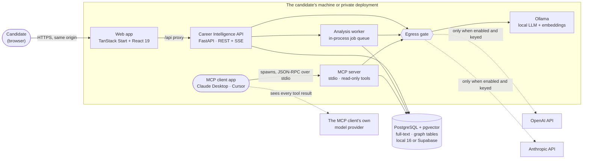

# Career Intelligence Assistant

Upload a CV, optional supporting cover letters, and a set of job descriptions. The
system works out what each role actually requires, maps every requirement to evidence
in the CV, scores the fit arithmetically, and turns that mapping into the things a
candidate actually needs — a prioritised gap plan, CV bullets, an interview pack, a
cover letter draft — with every claim traceable to the span of text it came from.

> **Status (2026-10-02):** one chunk/search/judge analysis with provider-specific
> execution budgets, batched calls, bounded parallel work and visible call/time
> estimates. The v1 analysis and selector are retired. Current model quality and
> end-to-end latency still need the measured release checks in [PLAN.md](PLAN.md).
> This is a private, single-user local tool.


## How it works

A naive version of this product asks a model "how good is this candidate for this
job?" and prints the answer. That is unverifiable and it flatters. This build keeps
one rule instead: **every statement it makes about a candidate traces to text in a
real document.** The model reads, classifies and judges; the server checks every
quote and citation against the stored text; domain code computes the score. When the
evidence is missing, the product says so rather than filling the gap.

- How it works: [docs/architecture.md](docs/architecture.md)

## What it does

| Feature | What it gives you |
|---|---|
| **Fit analysis** | A prose summary of the strongest match and biggest gap, every requirement as met, partial or missing with the quoted CV text that justifies it, and a score broken into must-haves, desirables and recency |
| **Gap plan** | Every gap ordered by how much the score would move if you closed it, with the nearest thing you already have and what to do about it. Fully deterministic — no model runs here |
| **CV bullets** | A draft bullet for a gap you can already evidence, built only from claims already in your CV, with the spans it came from |
| **Interview pack** | What they will probe, the evidence to lead with, where you are thin, and what to ask them |
| **Cover letter** | A paragraph draft grounded in matched evidence, with numbered citations and a glossary of source passages. Refuses when too little is matched, and says why |
| **Ranking and compare** | Roles ordered by fit with the deciding requirements named, and two roles side by side. Incomplete analyses are kept out of the ranking |
| **Ask** | Questions answered by the configured model from the stored mapping, with citation chips that open the source text |
| **Provider choice** | Local or hosted models, chosen in the UI, behind an egress gate, with every answer recording what produced it |

The rules that keep each one honest are in [docs/features.md](docs/features.md);
step-by-step use and screenshots are in [docs/how-to-use.md](docs/how-to-use.md).

## Architecture

One evidence-bound modular monolith with parallel I/O and separate CPU parsing.


```mermaid
flowchart LR
  candidate(["Candidate<br/>(browser)"])

  subgraph machine ["The candidate's machine or private deployment"]
    mcpc(["MCP client app<br/>Claude Desktop · Cursor"])
    web["Web app<br/>TanStack Start + React 19"]
    api["Career Intelligence API<br/>FastAPI · REST + SSE"]
    mcp["MCP server<br/>stdio · read-only tools"]
    worker["Analysis worker<br/>in-process job queue"]
    gate{{"Egress gate"}}
    ollama["Ollama<br/>local LLM + embeddings"]
  end

  db[("PostgreSQL + pgvector<br/>full-text · graph tables<br/>local 16 or Supabase")]
  openai["OpenAI API"]
  anthropic["Anthropic API"]
  clientllm["The MCP client's own<br/>model provider"]

  candidate -->|HTTPS, same origin| web
  web -->|/api proxy| api
  mcpc -->|spawns, JSON-RPC over stdio| mcp
  api --> worker
  api --> db
  worker --> db
  mcp --> db
  api --> gate
  worker --> gate
  mcp --> gate
  gate --> ollama
  gate -.->|only when enabled and keyed| openai
  gate -.->|only when enabled and keyed| anthropic
  mcpc -.->|sees every tool result| clientllm
```

The API, worker and MCP server are entry points into one modular monolith with ports
and adapters. One PostgreSQL database holds documents, chunks, vectors, the
full-text index, the knowledge graph and every judgement, so a hard delete is one
transaction. Hosted models are unreachable unless the server opens the egress gate
and holds a key ([docs/model-providers.md](docs/model-providers.md)).

## Quick start

| Path | You need | First commands |
|---|---|---|
| Make | Python 3.14, bun, local PostgreSQL 16 with pgvector on port 5432, Ollama | `make setup` then `make run` |
| Docker | Docker Engine and Compose v2 | `make run-docker` — written but not yet verified end to end (PLAN 16.1) |

```bash
ollama pull qwen2.5:7b && ollama pull nomic-embed-text
make setup   # config/app.env, Python venv from the lock, bun install
make test    # hermetic backend and frontend tests — no database, key or model
make run     # migrate, then API and web; open http://localhost:3000
```

Every command, the database topology, Compose and logging:
[docs/running-locally.md](docs/running-locally.md).

## Documentation

| Topic | Read |
|---|---|
| **Product** | [Features](docs/features.md) · [How to use it](docs/how-to-use.md) · [Known limitations and what's next](docs/limitations.md) |
| **Architecture** | [Architecture](docs/architecture.md) · [Decisions (ADRs)](docs/adr/) · [Model providers and the egress gate](docs/model-providers.md) · [Route wiring](docs/production-wiring.md) · [API contract](docs/api-contract.md) |
| **Running it** | [Running locally](docs/running-locally.md) · [MCP server](docs/mcp.md) · [Productionisation](docs/productionisation.md) |
| **Trust and quality** | [Evaluation](docs/evaluation.md) · [Privacy position](docs/privacy.md) · [Threat model](docs/threat-model.md) · [Engineering standards and AI use](docs/engineering-standards.md) |
| **Working on it** | [AGENTS.md](AGENTS.md) (protocol for coding agents; [CLAUDE.md](CLAUDE.md) imports it) · [PLAN.md](PLAN.md) (tasks and gates) · [BACKLOG.md](BACKLOG.md) (open work, in order) · [AI_DEVELOPMENT_LOG.md](AI_DEVELOPMENT_LOG.md) · [Engineering journal](docs/engineering-journal.md) |
| **Frontend** | [Lovable brief](docs/frontend-brief.md) · [Integration record](docs/frontend-integration.md) |
| **Logging plan** | [Phase 15B detail](docs/observability-logging-plan.md) |

## Licence

Proprietary — see [LICENSE](LICENSE).
