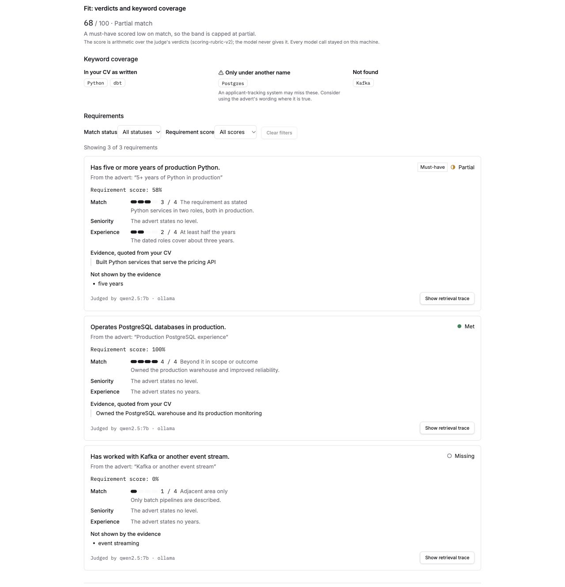
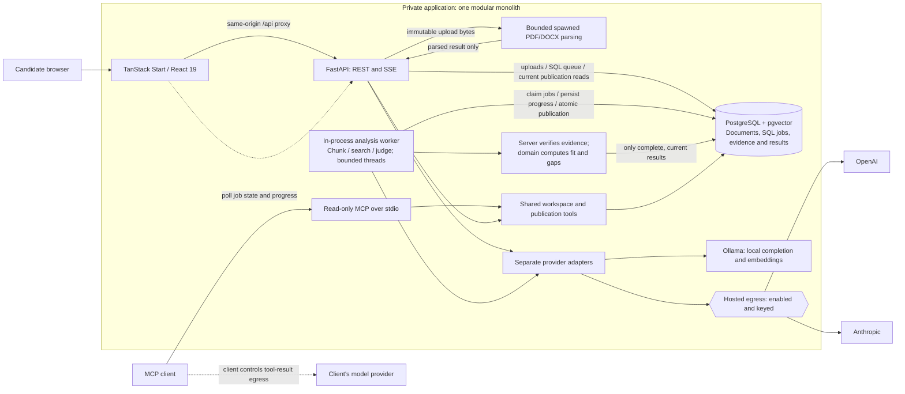

# Career Intelligence Assistant

Upload a CV, optional supporting cover letters, and a set of job descriptions. The
system works out what each role actually requires, maps every requirement to evidence
in the CV, scores the fit arithmetically, and turns that mapping into the things a
candidate actually needs — a prioritised gap plan, CV bullets, an interview pack, a
cover letter draft — with every claim traceable to the span of text it came from.

> **Status (2026-10-07):** one chunk/search/judge analysis with PostgreSQL-backed
> jobs and bounded parallel work. Server checks cited evidence; domain code computes
> fit. Requirements show green earned points and red shortfalls from full credit.
> Experience and seniority use overall CV/job context with asked/supported labels;
> reanalyse to obtain new judgments. Ask shows processing, receiving and history refresh.
> PRs [#46](https://github.com/ArifMehmood16/career-intelligence-assistant/pull/46)
> and [#47](https://github.com/ArifMehmood16/career-intelligence-assistant/pull/47)
> are merged. Retirement, provider efficiency and concurrency/progress acceptance
> are verified, including real parser failure/shutdown cleanup and thread accounting.
> Local lint, 825 backend tests and 192 frontend tests pass. Measured quality,
> complete browser journeys, security and startup proof remain open in [PLAN.md](PLAN.md).
> This is a private, single-user local tool.

The current synthetic cold/warm benchmark is implemented but unexecuted. Usage and
measurement limits are in [Evaluation](docs/evaluation.md#current-analysis-benchmark-plan-194).



*Synthetic example rendered from the current component gallery; [screenshots and usage](docs/how-to-use.md).*

## How it works

The CV and job description become server-numbered chunks. The job's requirements
search the stored CV evidence; a model judges match, experience and seniority in
capacity-sized batches using overall career/job context and explicit numeric or
qualitative experience expectations. The server checks quoted evidence against stored text,
then domain arithmetic computes requirement scores, overall fit and gap priorities.
Incomplete work publishes no score. Fit, gaps, ranking, preparation, drafts and
Ask read the same validated publication. Start with the
[step-by-step guide](docs/how-to-use.md), including filters, source citations,
analysis failures and reanalysis after an upgrade.

- How it works: [docs/architecture.md](docs/architecture.md)

## What it does

| Feature | What it gives you |
|---|---|
| **Fit analysis** | Every requirement as met, partial or missing, with match, experience and seniority judgments, quoted CV evidence, retrieval traces and a domain-computed score; filter by status/score, see earned points and shortfalls, and compare asked versus supported experience |
| **Gap plan** | Every gap ordered by how much the score would move if you closed it, with the nearest thing you already have and what to do about it. Fully deterministic — no model runs here |
| **CV bullets** | A draft bullet for a gap you can already evidence, built only from claims already in your CV, with the spans it came from |
| **Interview pack** | What they will probe, the evidence to lead with, where you are thin, and what to ask them |
| **Cover letter** | A paragraph draft grounded in matched evidence, with numbered citations and a glossary of source passages. Refuses when too little is matched, and says why |
| **Ranking and compare** | Roles ordered by fit with the deciding requirements named, and two roles side by side. Incomplete analyses are kept out of the ranking |
| **Ask** | Questions answered by the configured model from the validated analysis, with source citations and the tools used during the current session; immediate processing and answering status |
| **Provider choice** | Local or hosted models, chosen in the UI, behind an egress gate, with every answer recording what produced it |

The rules that keep each one honest are in [docs/features.md](docs/features.md);
step-by-step use and screenshots are in [docs/how-to-use.md](docs/how-to-use.md).

## Architecture

One evidence-bound modular monolith with parallel I/O and separate CPU parsing.


```mermaid
flowchart LR
  candidate["Candidate browser"] --> web["TanStack Start / React 19"]
  subgraph app["Private application: one modular monolith"]
    web -->|same-origin /api proxy| api["FastAPI: REST and SSE"]
    api -->|immutable upload bytes| parse["Bounded spawned PDF/DOCX parsing"]
    parse -->|parsed result only| api
    api -->|uploads / SQL queue / current publication reads| db[("PostgreSQL + pgvector<br/>Documents, SQL jobs, evidence and results")]
    worker["In-process analysis worker<br/>Chunk / search / judge; bounded threads"] -->|claim jobs / persist progress / atomic publication| db
    web -.->|poll job state and progress| api
    worker --> verify["Server verifies evidence;<br/>domain computes fit and gaps"]
    verify -->|only complete, current results| db
    api --> adapters["Separate provider adapters"]
    worker --> adapters
    adapters --> local["Ollama: local completion and embeddings"]
    adapters --> gate{{"Hosted egress: enabled and keyed"}}
    mcp["Read-only MCP over stdio"] --> tools["Shared workspace and publication tools"]
    api --> tools
    tools --> db
  end
  gate --> openai["OpenAI"]
  gate --> anthropic["Anthropic"]
  client["MCP client"] --> mcp
  client -.->|client controls tool-result egress| clientmodel["Client's model provider"]
```

The API enqueues work in PostgreSQL and returns before analysis finishes. The worker
claims jobs, overlaps independent I/O, validates judgments and publishes the result.
The read-only MCP server exposes the same stored workspace through shared tools.
Documents, chunks, vectors, full-text/graph indexes, judgments, scores and generated
artifacts share one database, so hard deletion is transactional. Hosted models are
unreachable unless the server opens the egress gate
and holds a key ([docs/model-providers.md](docs/model-providers.md)).
The application gate does not control an MCP client's own model. See the
[analysis, publication, job-lifecycle and retirement diagrams](docs/architecture.md)
for execution boundaries.

## Quick start

| Path | You need | First commands |
|---|---|---|
| Make | Python 3.14, bun, local PostgreSQL 16 with pgvector on port 5432, Ollama | `make setup` then `make run` |
| Docker | Docker Engine and Compose v2 | `make run-docker` — written but not yet verified end to end (PLAN 19.4) |

```bash
ollama pull qwen2.5:7b && ollama pull nomic-embed-text
make setup   # config/app.env, Python venv from the lock, bun install
make test    # hermetic backend and frontend tests — no database, key or model
make run     # migrate, then API and web; open http://localhost:3000
```

Every command, the database topology, Compose and logging:
[docs/running-locally.md](docs/running-locally.md).

## Documentation

| Topic | Read |
|---|---|
| **Product** | [Features](docs/features.md) · [How to use it](docs/how-to-use.md) · [Known limitations and what's next](docs/limitations.md) |
| **Architecture** | [Architecture](docs/architecture.md) · [Decisions (ADRs)](docs/adr/) · [Model providers and the egress gate](docs/model-providers.md) · [Route wiring](docs/production-wiring.md) · [API contract](docs/api-contract.md) |
| **Running it** | [Running locally](docs/running-locally.md) · [MCP server](docs/mcp.md) · [Productionisation](docs/productionisation.md) |
| **Trust and quality** | [Evaluation](docs/evaluation.md) · [Privacy position](docs/privacy.md) · [Threat model](docs/threat-model.md) · [Engineering standards and AI use](docs/engineering-standards.md) |
| **Working on it** | [AGENTS.md](AGENTS.md) (protocol for coding agents; [CLAUDE.md](CLAUDE.md) imports it) · [PLAN.md](PLAN.md) (tasks and gates) · [BACKLOG.md](BACKLOG.md) (open work, in order) · [Spec Kit adoption](docs/spec-kit.md) · [AI_DEVELOPMENT_LOG.md](AI_DEVELOPMENT_LOG.md) · [Engineering journal](docs/engineering-journal.md) |
| **Frontend** | [Lovable brief](docs/frontend-brief.md) · [Integration record](docs/frontend-integration.md) |
| **Logging plan** | [Phase 15B detail](docs/observability-logging-plan.md) |

## Licence

Proprietary — see [LICENSE](LICENSE).
