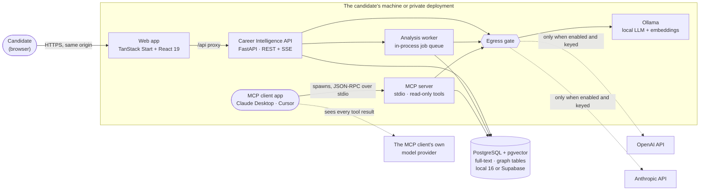
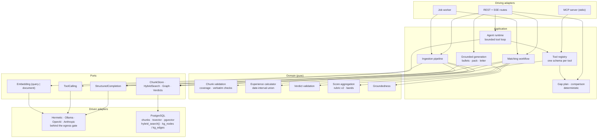
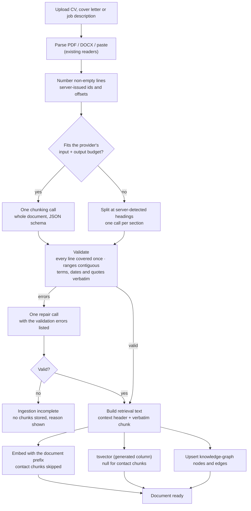
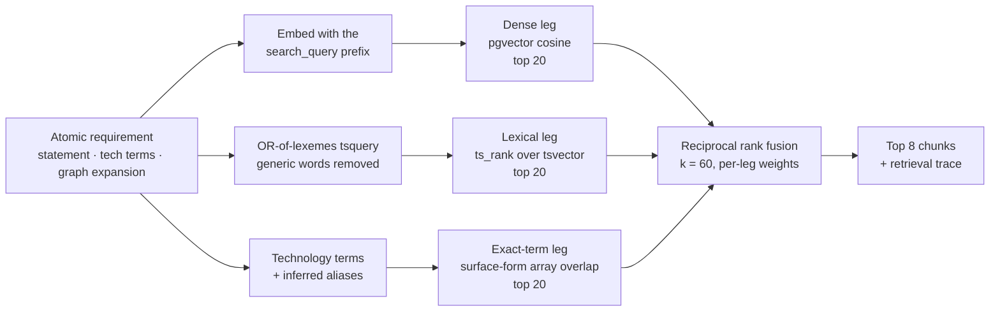
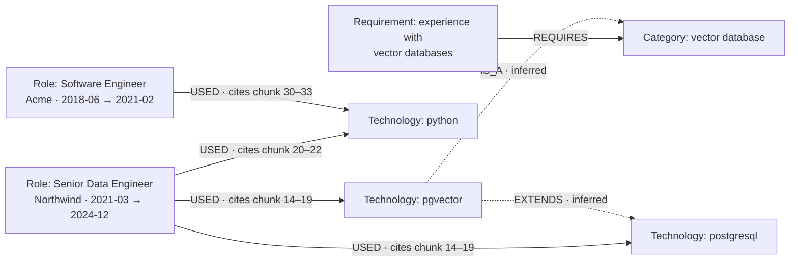
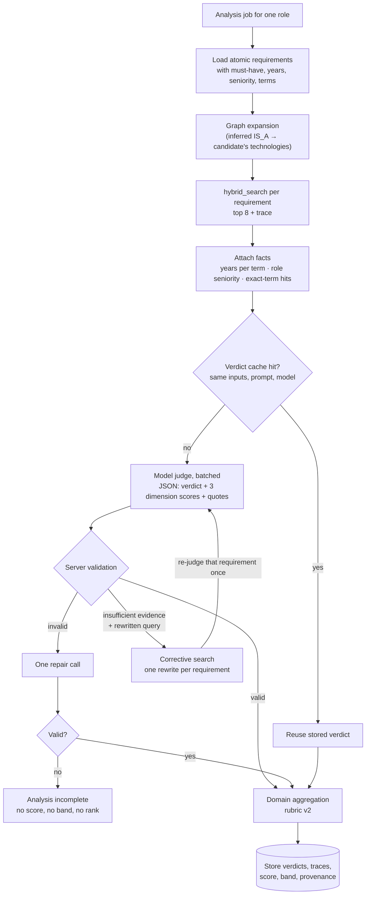
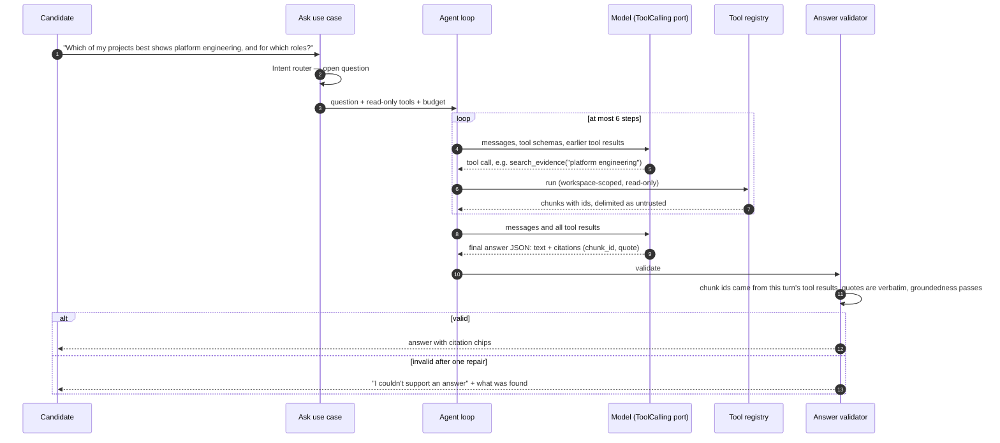
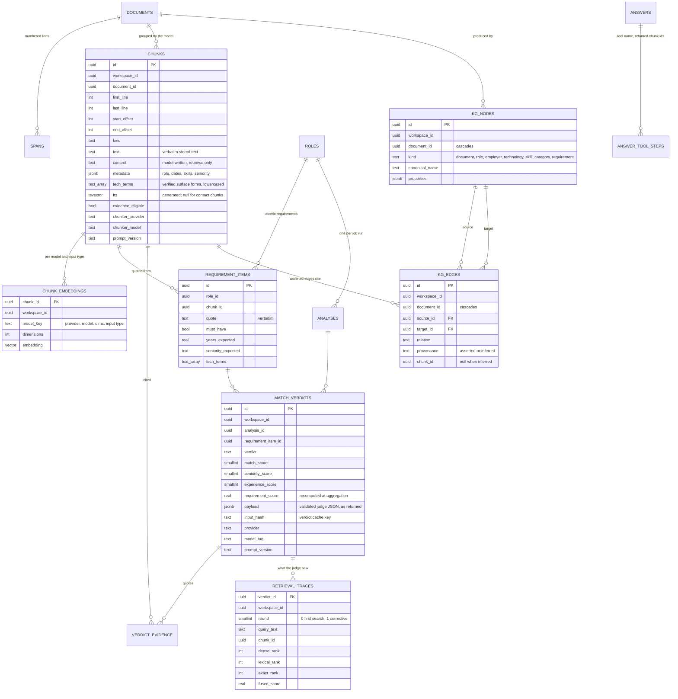

# Architecture v2 — hybrid retrieval, a model judge, agents and MCP

> **Status (2026-09-29): accepted, being built.** This is the target architecture for
> [PLAN.md Phase 18](../PLAN.md#phase-18--architecture-v2-hybrid-retrieval-model-judgement-agents-and-mcp);
> building starts with 18.1. The running product is still the v1 path described in
> [architecture.md](architecture.md).
> Nothing on this page is measured; every threshold and weight below is a starting
> value that Phase 18.14 calibrates on development data. The decisions are recorded
> in [ADR 013](adr/013-chunks-hybrid-search-knowledge-graph.md),
> [ADR 014](adr/014-model-judges-domain-aggregates.md) and
> [ADR 015](adr/015-agents-and-mcp-over-one-tool-registry.md), accepted in PLAN 18.0 on
> 2026-09-29.

## Contents

1. [Why v1 is being replaced](#1-why-v1-is-being-replaced)
2. [The invariant, restated](#2-the-invariant-restated)
3. [System context](#3-system-context)
4. [Components](#4-components)
5. [Ingestion: the model defines the chunks](#5-ingestion-the-model-defines-the-chunks)
6. [Hybrid search](#6-hybrid-search)
7. [Knowledge graph](#7-knowledge-graph)
8. [The matching workflow and the model judge](#8-the-matching-workflow-and-the-model-judge)
9. [Scoring](#9-scoring)
10. [Agentic Ask](#10-agentic-ask)
11. [One tool registry, two surfaces: the agent and MCP](#11-one-tool-registry-two-surfaces-the-agent-and-mcp)
12. [Providers, structured output and token budgets](#12-providers-structured-output-and-token-budgets)
13. [Data model](#13-data-model)
14. [Supabase readiness](#14-supabase-readiness)
15. [Security and privacy changes](#15-security-and-privacy-changes)
16. [Evaluation](#16-evaluation)
17. [What is kept, replaced and retired](#17-what-is-kept-replaced-and-retired)
18. [Where each technique lives](#18-where-each-technique-lives)
19. [Deliberately not in v2](#19-deliberately-not-in-v2)

---

## 1. Why v1 is being replaced

v1 made the model a classifier of tiny, server-cut pieces of text and pushed every
language judgement it could into domain rules. That kept the model honest, and it
produced an accretion of heuristics that each patched the last one. Between
2026-09-22 and 2026-09-24, ADR 010 gained nine amendments and ADR 011 three: line
and sentence segmentation, PDF line reflow, a delivered-work verb list, "Own" and
"Lead" only as opening words, a 0.35 retrieval abstain cutoff beside a 0.55 mapping
floor, and a special case for a tool named on a skills line.

The root causes are architectural, not prompt-level:

| Observation in v1 | Consequence |
|---|---|
| The model classifies one line or sentence at a time, 12 spans per call | It never sees a role as a unit, so dates, titles and bullets are stitched back together by rules |
| Output capped at 2,000–4,096 tokens (`LLM_MAX_OUTPUT_TOKENS`, capability descriptors) | Small batches were the fix for truncated JSON, and batching created the stitching problem |
| The Ollama adapter never sends `num_ctx` | The prompt window is the Ollama server default, not the 32,768 the descriptor declares, and a long prompt is cut without an error |
| The Anthropic adapter asks for JSON in prose | Schema compliance depends on the model's goodwill instead of the API's structured-output support |
| Retrieval is token overlap plus exact cosine computed in Python | No lexical index, no ranking fusion, nothing an Ask question or a second role can reuse |
| `nomic-embed-text` is called without its `search_query:` / `search_document:` prefixes | The embedding model runs outside the mode it was trained for |
| The assessor returns only `met` / `partial` / `missing` | Seniority and years of experience have no place to be judged, so they became rules |
| Exact technology names are handled by one domain special case | "PostgreSQL" versus "Postgres", and an applicant-tracking system's literal matching, are invisible |

v2 moves the language work to the model, where it belongs, gives it the context and
output room modern models have, and keeps the part of v1 that was right: **the
server verifies everything the model says against stored text, and the arithmetic
stays in domain code.**

## 2. The invariant, restated

**The model reads and judges. The server verifies. The domain does the arithmetic.**

1. The model defines chunks, but a chunk is a range of server-numbered lines. Its
   text is always the stored text, never the model's words.
2. Anything the model writes that the product treats as the document's words — a
   technology name, a skill, a title, a date, a number of years, a quote — must
   appear verbatim in the text it points at, or it is dropped. Everything else the
   model writes is an interpretation (a chunk's kind, a role's level, a canonical
   spelling, a restated requirement) and is stored and shown as one.
3. The model judges each requirement on up to three anchored scales (match,
   seniority, experience). A non-zero match score must quote the chunk text behind
   it; seniority and experience are judged against supplied facts. Retrieval decides
   what the judge may see; it may cite nothing else.
4. The domain computes years of experience from parsed dates, aggregates the
   judgements with visible weights, and decides bands. No model emits a fit score.
5. An incomplete chunking or judgement is a failed analysis, never a low score.
6. Model-written text used only to help retrieval — a chunk's context header, an
   inferred graph edge, a rewritten query — is never shown or cited as evidence.

v1's `met` / `partial` / `missing` was already a model judgement on a three-point
scale. v2 widens it to three five-point scales and says so, rather than hiding
seniority and tenure judgements inside regular expressions.

## 3. System context



The API, the worker and the MCP server are three entry points into one modular
monolith. The MCP client is an application on the same machine, because stdio
only works locally; the model behind it may not be local, which §11 deals with. They share the application layer, the ports and the egress gate. The
database is one PostgreSQL instance that holds documents, chunks, vectors, the
full-text index, the knowledge graph and every judgement, so a hard delete is still
one transaction.

## 4. Components



The dependency rule is unchanged: `domain/` and `application/` import no web
framework, ORM, provider SDK or MCP SDK, and the architecture guard test gains
`mcp` in its forbidden list. The MCP server is a driving adapter beside FastAPI; it
calls the same use cases through the tool registry.

## 5. Ingestion: the model defines the chunks

### Pipeline



The server numbers the lines; the model groups them. That keeps the one property v1
got right — the model cannot put words in the candidate's mouth — while letting the
model see a whole role, a whole project or a whole requirement block at once. A
sentence that wrapped across two PDF lines is simply two lines in one chunk, which is
why the reflow heuristics can retire once the evaluation confirms it.

### What the model returns

One call per document returns every chunk with its metadata. Abridged example for a
CV:

```json
{
  "chunks": [
    { "first_line": 1, "last_line": 3, "kind": "contact" },
    {
      "first_line": 13, "last_line": 13, "kind": "role_heading",
      "role": { "employer": "Northwind", "title": "Senior Data Engineer",
                "date_text": "Mar 2021 – Dec 2024", "seniority_level": "senior" }
    },
    {
      "first_line": 14, "last_line": 19, "kind": "experience", "role_ref": 13,
      "context": "Senior Data Engineer at Northwind, 2021–2024: platform and retrieval work.",
      "skills": ["hybrid retrieval"],
      "tech_terms": [ { "surface": "pgvector", "canonical": "pgvector" },
                      { "surface": "Postgres", "canonical": "postgresql" } ]
    }
  ]
}
```

`role_ref` is the first line of the role heading a chunk belongs to, so a bullet
several chunks into a long role still inherits its employer and dates. The
`canonical` spelling and the `seniority_level` are the model's interpretations: a
canonical spelling that differs from the surface form becomes an inferred alias in
the knowledge graph (§7), and the level is shown as the model's reading of a
verified title.

Chunk kinds by document:

| Document | Kinds | Evidence-eligible |
|---|---|---|
| CV | `role_heading`, `experience`, `project`, `skills`, `qualification`, `summary`, `contact`, `other` | `experience`, `project`, `skills`, `qualification` |
| Cover letter | `experience`, `aspiration`, `motivation`, `other` | `experience` only ([ADR 011](adr/011-evidence-assessment-contract.md) letter policy) |
| Job description | `requirement`, `responsibility`, `benefit`, `logistics`, `about`, `other` | — (these are queries, not evidence) |

A job-description `requirement` or `responsibility` chunk also carries its
**atomic requirements**, so one line asking for "5+ years of Python and AWS" becomes
two assessable items. Each keeps the verbatim clause it came from. The `statement`
is the model's restatement, used for retrieval and in the judge's prompt, and never
shown as the advert's words:

```json
{
  "first_line": 22, "last_line": 22, "kind": "requirement",
  "atomic_requirements": [
    { "quote": "5+ years of Python and AWS", "statement": "5+ years of Python",
      "must_have": true, "years_expected": 5, "seniority_expected": null,
      "tech_terms": [ { "surface": "Python", "canonical": "python" } ] },
    { "quote": "5+ years of Python and AWS", "statement": "Experience with AWS",
      "must_have": true, "years_expected": null, "seniority_expected": null,
      "tech_terms": [ { "surface": "AWS", "canonical": "aws" } ] }
  ]
}
```

Whether the five years also apply to AWS is a reading of ambiguous English. The
model makes it, and the Fit tab shows the statement beside the quote so the
candidate can see which reading was scored.

### What the server checks

| Check | Rule | On failure |
|---|---|---|
| Coverage | Every line is in exactly one chunk; page numbers and other noise are kind `other` | Repair call, then incomplete |
| Shape | Ranges are ascending, contiguous and inside the document | Repair call, then incomplete |
| Size | A chunk is at most `CHUNK_MAX_LINES` lines and `CHUNK_MAX_TOKENS` tokens, and fits the embedding model's context | Repair call, then incomplete |
| Role reference | `role_ref` points at a preceding `role_heading` chunk | Repair call, then incomplete |
| Verbatim | Each `tech_terms[].surface`, `skills` entry, `role.employer`, `role.title`, `role.date_text` and atomic `quote` appears in its chunk (whitespace-normalised; case-insensitive for terms and skills). `years_expected` appears as a number in the quote; `seniority_expected` appears as a level word in the quote or the advert's title | That field is dropped and counted; a missing requirement quote fails the chunk |
| Dates | `date_text` is parsed by domain code; the model never supplies a duration | Unparsed dates make the chunk undated |
| Enums | `kind`, `seniority_level`, `must_have` are from the schema's enums | Repair call, then incomplete |

Whitespace normalisation is not fuzzy matching: a quote either appears in the stored
text once runs of whitespace are collapsed, or it is rejected.

**Contextual retrieval.** The `context` header is the chunker's one-sentence
situating summary, prepended to the verbatim text before embedding and before
building the `tsvector`. It improves recall for chunks such as a bullet that never
names its employer. It is model-written, so it is never displayed as evidence and
never quotable.

**Personal data.** `contact` chunks are stored for citation resolution but are never
embedded, never indexed for full-text search and never sent to the judge.

## 6. Hybrid search

Every requirement becomes a query that runs three ways at once over the candidate's
evidence-eligible chunks, and the three ranked lists are fused.



| Leg | Finds | Misses |
|---|---|---|
| Dense (semantic) | Paraphrase: "shipped retrieval over embeddings" for "built RAG systems" | Rare exact names, version strings, acronyms |
| Lexical (full-text) | Shared words after stemming, weighted by density | Paraphrase; the `english` parser turns `C#` and `C++` into `c` and `.NET` into `net` |
| Exact-term | The named technology, however the sentence around it is phrased, matched on verified surface forms | Anything not a named technology |

Reciprocal rank fusion scores each chunk as the weighted sum of `1 / (k + rank)`
over the legs that found it. It needs no score normalisation between a cosine, a
`ts_rank` and a count, which is why it is the default fusion method rather than a
weighted sum of raw scores. The weights start at 1.0 each; 18.14 calibrates them.

**Why the lexical query is OR-ed.** `websearch_to_tsquery` over a requirement
sentence ANDs every word, and almost no CV bullet contains all of them. The query is
the requirement's lexemes joined with `|`. Generic requirement words (`experience`,
`years`, `strong`, `knowledge`, `ability` and similar) are removed first by the
application, because after stemming they match nearly every chunk. Ranking uses
`ts_rank`, which rewards covering more of the query's terms. `ts_rank_cd` was tried
and rejected: with an OR query it scored `python python python python` above
`python kafka aws`.

**Why the exact-term leg matches surface forms.** It compares the lowercased
technology names that were verified in the text, so "PostgreSQL" in an advert
matches "PostgreSQL" in a CV exactly. The model's canonical spellings are inferred
aliases (§7): they add "postgres" to the query terms to widen the search, and a
match found only that way is reported as an alias, not as an exact match.

**The function.** Search is one SQL function, so the matching workflow, the agent
and the MCP server share one query, and it runs unchanged on a Supabase project. The
sketch below was executed on 2026-09-29 against PostgreSQL 16.13 and pgvector 0.6.0,
with pgvector in an `extensions` schema and synthetic rows: workspace isolation, the
active-CV rule, the source filter and all three legs behaved as described. It is a
sketch, not the migration.

```sql
-- The migration sets search_path = career_assistant, extensions, public first:
-- parameter types such as vector resolve when the function is created.
create or replace function career_assistant.hybrid_search(
  p_workspace_id    uuid,
  p_query_text      text,    -- generic requirement words already removed
  p_query_embedding vector,
  p_query_terms     text[],
  p_embedding_model text,
  p_sources         text[] default array['cv', 'cover_letter'],
  p_match_count     int    default 8,
  p_leg_count       int    default 20,
  p_weights         float8[] default array[1.0, 1.0, 1.0],  -- dense, lexical, exact
  p_rrf_k           int    default 60
)
returns table (chunk_id uuid, fused_score float8,
               dense_rank int, lexical_rank int, exact_rank int)
language sql stable security invoker
set search_path = career_assistant, extensions, public
as $$
  with eligible as (
    select c.id, c.fts, c.tech_terms
    from chunks c join documents d on d.id = c.document_id
    where c.workspace_id = p_workspace_id
      and c.evidence_eligible
      and d.kind = any (p_sources)
      and (d.kind <> 'cv' or d.is_active)
  ),
  q as (
    select replace(plainto_tsquery('english', p_query_text)::text, '&', '|')::tsquery as tsq
  ),
  dense as (
    select e.chunk_id,
           row_number() over (order by e.embedding <=> p_query_embedding, e.chunk_id)::int as r
    from chunk_embeddings e join eligible el on el.id = e.chunk_id
    where e.workspace_id = p_workspace_id and e.model_key = p_embedding_model
    order by r
    limit p_leg_count
  ),
  lexical as (
    select el.id as chunk_id,
           row_number() over (order by ts_rank(el.fts, q.tsq) desc, el.id)::int as r
    from eligible el, q
    where el.fts @@ q.tsq
    order by r
    limit p_leg_count
  ),
  exact as (
    select el.id as chunk_id,
           row_number() over (order by cardinality(array(
             select unnest(el.tech_terms) intersect select unnest(p_query_terms))) desc,
           el.id)::int as r
    from eligible el
    where el.tech_terms && p_query_terms
    order by r
    limit p_leg_count
  )
  select coalesce(d.chunk_id, l.chunk_id, x.chunk_id),
         coalesce(p_weights[1] / (p_rrf_k + d.r), 0)
       + coalesce(p_weights[2] / (p_rrf_k + l.r), 0)
       + coalesce(p_weights[3] / (p_rrf_k + x.r), 0),
         d.r, l.r, x.r
  from dense d
  full join lexical l on l.chunk_id = d.chunk_id
  full join exact   x on x.chunk_id = coalesce(d.chunk_id, l.chunk_id)
  order by 2 desc, 1
  limit p_match_count;
$$;
```

The migration (`e2c7a4b9d150`, PLAN 18.6) differs from the sketch in two guards: it
also filters `documents` by workspace, and it refuses job-description chunks even if
a caller lists them as a source. The exact-term leg compares lowercased values, so
whatever writes `chunks.tech_terms` stores them lowercased. `SqlHybridSearch` and the
test-only in-memory fake pass one contract suite; the fake's lexical leg is word
overlap, so stemming and the `C#` / `C++` behaviour are pinned by PostgreSQL-only
tests.

**Indexes.** A GIN index on `chunks.fts`, a GIN index on `chunks.tech_terms`, and a
B-tree on `chunk_embeddings (workspace_id, model_key)`, so the dense leg is an exact
scan over one workspace's vectors. A workspace holds tens to hundreds of chunks; at
that size an exact scan is fast and has perfect recall. An approximate index such as
HNSW pays off when one query searches a very large set, and this product never
searches across workspaces. If one workspace ever grows that large, the path is a
partial HNSW index per embedding model — with the query repeating the index
predicate so the planner can use it — and pgvector 0.8's iterative scans so the
workspace filter does not starve the result set. It is written down, not built.

**The retrieval trace.** For every requirement, matching stores the query text,
the round (0, or 1 after the one rewrite), and each candidate's dense, lexical and
exact ranks and fused score. The terms are not stored: `retrieval_traces` has no
column for them, and they follow from the requirement item. "Why
did the judge see this bullet and not that one?" is a query, not a guess.

## 7. Knowledge graph

The graph is two tables in the same PostgreSQL database, built from the chunk
metadata during ingestion. It exists for three jobs that plain chunks do badly.



| Job | How | Where the answer goes |
|---|---|---|
| **Years of experience** | Domain code takes the union of the parsed date intervals of every role with a `USED` edge to a technology or skill, so overlapping roles are not double-counted. "Present" resolves to the analysis's `as_of` date. The result is an upper bound — a role counts in full if any of its chunks mentions the technology — and is labelled that way | A fact in the judge's packet: "python — up to 6.5 years across 2 roles, last used 2024-12" |
| **Query expansion** | A requirement that names a category ("vector databases") follows inferred `IS_A` edges to technologies the candidate's graph contains (pgvector) and adds them to the lexical and exact-term legs | More recall; the judge still has to cite the chunk that mentions pgvector |
| **Agent questions** | The `skill_experience` tool answers "where and when did I use Kafka?" with a recursive CTE, depth ≤ 2 | Cited answers in Ask and over MCP |

**Two kinds of edge, never confused.**

- *Asserted* edges (`USED`, `AT`, `REQUIRES`, `MENTIONS`) come from a validated
  chunk and cite it. They can support a judgement.
- *Inferred* edges (`IS_A`, `EXTENDS`, `ALIAS_OF`) come from the model's general
  knowledge — one batched call per ingestion for the technology terms not seen
  before, plus the chunker's canonical spellings as `ALIAS_OF` — and cite nothing.
  They may widen a search. They are never evidence, never shown as a candidate's
  claim, and never count as an exact match.

Technology nodes are keyed by the spelling the document wrote, which the chunk
validation has checked. The chunker's canonical spelling is a separate node reached
by an inferred `ALIAS_OF` edge, so "postgresql" is never an exact match for a CV that
only wrote "Postgres". A skills line or project with no role is a `MENTIONS` edge
from the document's own `document` node; it cites its chunk but adds no years. If the
taxonomy call fails — an unusable reply, a refusal, a transient error — the graph is
stored without inferred edges and ingestion carries on, because those edges only
widen a search; a provider that is missing or not permitted still fails.

Every node and edge records the document it came from. Deleting that document
deletes them in the same transaction. Taxonomy edges are stored with the document
whose ingestion first met the term, so deleting it removes them too, and the next
ingestion that meets the term asks again.

**Why not a graph database.** A second store would break one-transaction hard
delete, needs its own backup and access story, and is not available on Supabase. The
graph is small, the traversals are two hops, and a recursive CTE over indexed
adjacency tables does it.

## 8. The matching workflow and the model judge

Matching is a **workflow**, not an agent: the steps are known in advance and the
result must be reproducible. The one agentic decision inside it is bounded — the
judge may ask for one more search.



### What the judge sees

For each requirement, a packet with:

- the requirement's verbatim quote and the model's statement of it, the must-have
  flag, and the verified `years_expected` and `seniority_expected`;
- the top candidate chunks, each with its id, kind, source (`cv` or
  `cover_letter`), role, dates and verbatim text, delimited and labelled untrusted;
- graph facts: years per required term (upper bounds, as of the analysis date), the
  level of each role in the candidate's history, and which required terms were found
  exactly, found only through an alias, or not found.

### What the judge returns

```json
{
  "verdicts": [
    {
      "requirement_id": "b1f0…",
      "verdict": "partial",
      "match": {
        "score": 3,
        "rationale": "Built hybrid retrieval on pgvector for an internal assistant.",
        "evidence": [ { "chunk_id": "7c2e…", "quote": "hybrid retrieval over pgvector" } ]
      },
      "seniority": { "score": 3, "rationale": "Held a senior title for the matching work." },
      "experience": { "score": 2, "rationale": "Asks for 5 years; the facts show up to 3.8 years with pgvector, in one role." },
      "unmet_conditions": ["5+ years with a vector database"],
      "contradiction": false,
      "retrieval_feedback": { "sufficient": true, "rewrite_query": null }
    }
  ]
}
```

### The anchors

Scores are integers on anchored scales. Anchored integer scales are more stable for
a model judge than a 0–100 number, and each point means something a reviewer can
argue with.

| Score | Match | Seniority | Experience |
|---|---|---|---|
| 0 | Nothing relevant | Two or more levels below | None |
| 1 | Adjacent area only | One level below, no ownership shown | Listed, coursework or hobby only, or under half the stated years |
| 2 | Part of the requirement shown | One level below, with ownership or leadership shown | At least half the stated years |
| 3 | The requirement as stated | At the level | Meets the stated years |
| 4 | Beyond it in scope or outcome | Above the level | Clearly exceeds the stated years |
| `null` | — | `seniority_expected` is null | `years_expected` is null |

`seniority_expected` is set only when the requirement or the advert's title states a
level, and `years_expected` only when the requirement states a number. Both are
verified at ingestion (§5). Depth without a number is part of match.

### What the server checks

| Rule | Why |
|---|---|
| Every requirement in the batch has exactly one verdict; ids are the ones sent | Completeness; no invented requirements |
| Every cited `chunk_id` is one of that requirement's candidates | The judge may only cite what retrieval showed it |
| Every `quote` appears verbatim (whitespace-normalised) in the cited chunk | The quote is what the UI highlights |
| A non-zero `match` score has at least one quote | No evidence, no credit |
| `missing` ⇔ `match` ≤ 1, and `met` ⇒ `match` ≥ 3 | The verdict and the score cannot disagree |
| `seniority` / `experience` are `null` exactly when `seniority_expected` / `years_expected` is null | The judge cannot invent or ignore a stated requirement |
| If every cited chunk is a `skills` chunk, match is capped at 2 and experience at 1. The one exception keeps v1's decided rule for a bare tool name (log entry 136): a `requirement` that states no years or level, and whose technology terms all appear on that line, may reach match 3 | A tool on a skills line is not delivery or tenure — v1's special case becomes one server rule |
| `contradiction: true` caps match at 2 and the verdict at `partial` | A stated negative outranks a keyword |
| Every clamp and cap is recorded on the verdict | A reviewer can see where the server overruled the judge |

A batch that fails validation gets one repair call listing the exact errors. A
requirement still invalid after that makes the analysis incomplete.

As built (PLAN 18.7), the rules live in `domain/judging.py` and the use case in
`application/judge/service.py`:

- The repair call carries only the requirements that failed, with each problem
  named by requirement id and field. Problems never repeat document text.
- A verdict for a requirement that was not sent is dropped, not repaired.
- A met verdict whose match a cap lowers below 3 becomes partial, and that is
  recorded too.
- The structured-output port already makes one schema repair. A reply still
  invalid after it leaves its batch incomplete, with no second judge call. A
  truncated reply splits the batch in half. A refusal, a transient failure or an
  oversized input leaves the batch incomplete. A closed egress gate or an
  unavailable provider is not a verdict, so it propagates.
- The judge sends temperature 0 and seed 0 only when the descriptor says the
  model accepts them.
- The cache key leaves out the requirement id, so an unchanged re-extraction
  reuses its verdict. A verdict is cached only when the model that answered is
  the configured one, so a fallback's answer is never replayed as the primary's.
  The digest comes from the capability descriptor (§12), so a re-pulled Ollama
  tag misses the cache.

### Corrective retrieval (the bounded agentic step)

When the judge sets `retrieval_feedback.sufficient` to `false`, it must supply a
`rewrite_query`. The workflow runs `hybrid_search` once more with that query plus the
original terms, merges any new candidates, and asks the judge again for that
requirement only. One rewrite per requirement and a per-analysis cap
(`JUDGE_MAX_REWRITES`) bound the cost. Both queries and both candidate sets are in the
trace. This is corrective RAG: the model decides whether it has enough evidence,
the workflow decides how much it is allowed to look.

As built (PLAN 18.8, `application/judge/matching.py`):

- Round 0 searches with the requirement's statement.
- Rewrites are granted in requirement order until the cap is reached.
- New candidates are appended after the first set, with duplicates removed.
- A rewrite that finds no new chunk makes no judge call.
- The first verdict stands if nothing new is found or the re-judgement is
  incomplete, because it already passed the server's rules.
- A requirement incomplete in round 0 is not searched again.
- The search behind it is a narrow `CandidateSearch` port returning hits for the
  trace and candidates for the judge. `HybridCandidateSearch`
  (`application/judge/candidate_search.py`) implements it over `hybrid_search` and
  the chunk store (PLAN 18.10).

### Reproducibility

The judge runs at temperature 0 with a fixed seed where the model accepts them; the
capability descriptor says whether it does, because some reasoning models reject a
temperature setting. Each verdict is cached under a hash of:

- the prompt and anchor versions;
- the provider, the model tag and, where the provider exposes one (Ollama does), the
  model digest, because a local tag can be re-pulled to different weights;
- the requirement and its facts, including the analysis's `as_of` date;
- the ordered candidate chunk ids and their text hashes. Every ordering in
  `hybrid_search` breaks ties on the chunk id, so identical inputs give an identical
  order.

Re-analysing unchanged inputs reuses the stored verdict, and replaying a saved
analysis reproduces its score exactly. `score_stability` is therefore 1.0 by
construction; it is checked, not claimed as a finding. The informative number is
`judge_stability` — agreement between fresh runs with the cache bypassed — which the
evaluation reports. The rubric is not in the key: aggregation is recomputed from
verdicts, so a rubric change re-scores without re-judging.

### Batching and budgets

Requirements per judge call come from the provider's capability descriptor, not a
fixed constant: `floor(min(model output limit, JUDGE_MAX_OUTPUT_TOKENS) / estimated
tokens per verdict)`, bounded by the input budget. A hosted model with a large window judges a whole role
in one or two calls; a local 7B model judges a handful at a time. The prompt is laid
out stable-first — rules, anchors and schema, then the candidate's graph facts, then
the requirement packets — so providers with prompt caching reuse the prefix across
calls.

## 9. Scoring

Scoring stays pure domain code, now reading `config/scoring_rubric.toml` version
`scoring-rubric-v2`.

For one requirement with applicable dimensions *D* — match always, seniority when
`seniority_expected` is set, experience when `years_expected` is set:

```text
requirement_score = min(1, Σ_{d ∈ D} w_d · s_d / (3 · Σ_{d ∈ D} w_d))   # 3 = "as stated" = full credit
                    × recency(latest dated cited chunk)                  # v1 recency table
                    = 0 when the verdict is missing

fit_score         = 100 · Σ_i W_i · requirement_score_i / Σ_i W_i
                    W = 3 for must-have, 1 for desirable                  # v1 weights
```

A 3 is full credit, so a candidate who meets every requirement as stated, recently,
scores 100. A 4 is recorded and shown but earns no bonus: exceeding one requirement
should not hide missing another.

| Setting | Starting value | Note |
|---|---|---|
| `w_match`, `w_experience`, `w_seniority` | 0.5, 0.3, 0.2 | Starting values, not measurements |
| Must-have / desirable weight | 3 / 1 | Unchanged from v1 |
| Recency | 1.0 within 2 years, 0.85 to 5 years, 0.7 beyond; undated evidence 0.85 | Unchanged from v1, including its undated rule |
| Bands | strong ≥ 75, partial ≥ 50 | Unchanged from v1 |
| Must-have gate | A must-have with `match` ≤ 1 caps the band at partial | New; one missing essential is not a strong match |

**Keyword coverage** is reported next to the fit score, not inside it. For each
required technology it shows *exact* (the advert's spelling appears in the CV),
*alias* (the model reads a different spelling as the same technology — "Postgres"
for "PostgreSQL" — an inferred link, labelled as one) or *missing*. The judge already sees these facts, so folding coverage into the fit
score would count them twice. It is shown separately because an applicant-tracking
system often matches strings literally, and a candidate who writes "Postgres" can
still be filtered out of a "PostgreSQL" search. That warning is practical advice the
product can back with evidence.

The **gap plan** keeps its v1 principle — ordered by how much the score would move —
and gains the dimension that would move it: "evidence exists but is one level
junior" is a different action from "no evidence at all".

As built (PLAN 18.9, `domain/scoring_v2.py`):

- The rubric is a `[v2]` table in `config/scoring_rubric.toml`. v1's keys and
  version are read unchanged.
- Each dimension is capped at 3 before weighting. The formula above, read
  literally, would let a match of 4 make up for experience of 2 inside one
  requirement; the cap is what makes "a 4 earns no bonus" hold there too.
- A verdict is missing, and scores 0, when its match is 1 or less. The server's
  rules make that the same thing as a `missing` label.
- Components are ordered by requirement id, so the same verdicts give the same
  numbers whatever order they arrive in.
- The gap plan gives each requirement one entry: its biggest single lift. That
  is raising one dimension to 3 or, for dated evidence past two years, recency
  to 1.0. A missing requirement is lifted as if its new evidence were recent,
  as v1 does. An incomplete analysis has no gap plan.

## 10. Agentic Ask

v1 routes every question with regular expressions. v2 keeps that router as a fast
path for the four questions it answers well from the stored analysis (gaps, fit,
compare, interview prep) and sends everything else to an agent.



**The budget.** At most `AGENT_MAX_STEPS` (6) model turns, `AGENT_MAX_TOOL_CALLS`
(10) tool calls and `AGENT_MAX_INPUT_TOKENS` per question. When the budget runs out
the agent must answer from what it has or say it cannot.

**The citation rule is stricter than v1's.** A citation is valid only if the agent
received that chunk from a tool call in this turn and the quote appears verbatim in
it. The model cannot cite a chunk id it guessed. Ask stores each tool call's name
and the ids of the chunks it returned with the answer; that record is what the
citation check reads and what the UI shows as the agent's steps.

**No framework.** The loop is a use case of roughly a hundred and fifty lines over a
`ToolCallingPort`. LangGraph, LangChain and LlamaIndex were considered and rejected
for the same reason v1 rejected them: the control flow, the budget and the egress
gate have to be visible and testable, and a hermetic scripted fixture has to be able
to drive the loop with no model.

**Degrading deterministically.** A provider whose capability descriptor reports no
tool calling does not get the agent; open questions fall back to v1's scoped
retrieval and phrasing path. The application never branches on a provider's name.

## 11. One tool registry, two surfaces: the agent and MCP

Each tool is defined once: a name, a description written for a model, a Pydantic
input schema, an output schema, a read-only flag, and a handler that calls an
existing use case. The in-app agent and the MCP server both read the same registry,
so a tool behaves identically whichever model is calling it.

| Tool | Input | Returns | Calls |
|---|---|---|---|
| `list_roles` | — | Roles with state, band and score | Role store |
| `search_evidence` | query, sources, role id?, k | Chunks with ids, verbatim text, ranks | `hybrid_search` |
| `get_role_analysis` | role id | Verdicts, dimension scores, keyword coverage | Verdict store |
| `explain_requirement` | requirement id | Verdict, quotes, retrieval trace | Verdict store |
| `get_gap_plan` | role id | Gaps ordered by score impact | Gap plan (deterministic) |
| `compare_roles` | two role ids | Side-by-side deciding requirements | Comparison (deterministic) |
| `skill_experience` | technology or skill | Years, roles, last used, citing chunks | Knowledge graph |
| `get_chunk` | chunk id | Verbatim text and source location | Chunk store |

Every tool is workspace-scoped and read-only in v2. Tools that write — adding a job
description, generating a letter — stay in the web app until confirmation can be
asked for mid-call (the MCP specification's `input_required` results) and is tested.

### The MCP server

- **What it is.** A driving adapter that exposes the registry as MCP tools with
  `outputSchema` and structured results, and `readOnlyHint` on every tool. It targets
  the 2026-07-28 MCP specification and keeps 2025-11-25 compatibility while clients
  catch up; the task verifies the official Python SDK's support before pinning it.
- **Transport.** stdio only: the MCP client launches `career-assistant-mcp` as a
  local process, so there is no network listener to secure. Streamable HTTP opens
  one, which needs authentication — the specification defines it with OAuth — and
  belongs with the authentication decision (see [§19](#19-deliberately-not-in-v2)).
- **Who can use it.** Claude Desktop or Cursor on the same machine can ask "which of
  my roles am I weakest on for Kubernetes?" and get the same cited answer the web app
  would give. An n8n workflow would need Streamable HTTP, which is not in v2.
- **Off by default.** `MCP_ENABLED` and the one workspace the server serves
  (`MCP_WORKSPACE_ID`) are read from the server's configuration file, not from the
  environment the MCP client launches the process with. The client controls that
  environment, so a switch there would not be a server decision. The process exits
  unless both are set in the file. Enabling it is a deliberate act, like opening the
  egress gate, because of the next point.

**The egress caveat.** When a hosted model behind an MCP client calls
`search_evidence`, the chunk text goes to that client's model provider. This server
cannot see or stop that. The egress gate governs the models *this* application
calls; the MCP client governs its own. Every tool description says so — under the
2026-07-28 specification a client is not required to fetch the server's
instructions — every tool result carries `leftMachine: "decided by the MCP client"`,
and the README states it plainly.

## 12. Providers, structured output and token budgets

### Structured output is enforced by the API, not requested in prose

The JSON contracts are Pydantic models in `application/contracts/`. The schema sent
to the provider is `Model.model_json_schema()`; the response is parsed with
`Model.model_validate_json()`; a validation error becomes the text of the repair
call. One definition, three uses. Each adapter adapts the schema to what its API
accepts — OpenAI's strict mode needs every property listed as required (optional
ones as nullable) and `additionalProperties: false`; Anthropic's structured outputs
support a subset of JSON Schema, so unsupported constraints move into descriptions —
and the full Pydantic validation still runs on every response, so no constraint is
lost.

| Provider | Structured output | Tool calling | v1 gap closed |
|---|---|---|---|
| Hermetic (test fixture) | Scripted, schema-valid fixtures | Scripted tool-call sequences | Drives the agent loop offline |
| Ollama | `/api/chat` with `format` set to the JSON schema, `num_ctx` set explicitly | `tools` on `/api/chat` for models that support it | Sends `num_ctx`; moves off `/api/generate` |
| OpenAI | `response_format` `json_schema` with `strict: true` | Function tools with `strict: true` | Adds `strict` |
| Anthropic | `output_config.format` with the JSON schema | Tools with `strict: true` | Replaces "Respond with JSON only" in the user prompt |

`CompletionPort` stays as it is for phrasing. Two narrow ports join it, following the
existing interface-segregation rule: `StructuredCompletionPort` (a request with a
schema, a validated object back) and `ToolCallingPort` (messages and tool schemas in,
tool calls or a final message out). The capability descriptor gains
`supports_tool_calling`, `supports_prompt_caching`, `supports_temperature` and
`supports_seed`, and its
context window and output limits come from a per-model table in configuration rather
than constants in the adapter. It also carries an optional `model_digest` (PLAN
18.7). The factory gives the Ollama adapter a lookup over `/api/tags`, and every
other provider reports none. The adapter keeps a digest once it finds one and
tries again after a failure. A failure reports no digest, which costs a verdict
cache miss, never a wrong reuse.

### Embeddings know whether they are embedding a query or a document

`EmbeddingRequest` gains `input_type: query | document`. The Ollama adapter adds
`search_query: ` or `search_document: ` for nomic models; OpenAI ignores it. The
Ollama adapter also sets `num_ctx` on embedding calls, because Ollama's
`nomic-embed-text` has a small default context, and `CHUNK_MAX_TOKENS` stays inside
the embedding model's context so no chunk is cut before it is embedded. Stored
vectors are keyed by provider, model tag, dimensions and input type, so changing any
of them re-embeds.

### Token budgets come from the model, not from fixed batch sizes

| Call | Input | Output cap (starting) | Calls per job |
|---|---|---|---|
| Chunk a CV | All numbered lines | `CHUNKING_MAX_OUTPUT_TOKENS` = 8,000 | 1, or 1 per section if it does not fit |
| Chunk a job description | All numbered lines | 4,000 | 1 |
| Classify new technology terms (inferred edges) | New terms only | 1,000 | 0–1 per ingestion |
| Judge | Cached prefix + requirement packets | the smaller of the model's limit and `JUDGE_MAX_OUTPUT_TOKENS` = 8,000 | ⌈requirements / batch⌉ + rewrites |
| Agent step | Conversation + tool results, ≤ `AGENT_MAX_INPUT_TOKENS` | 2,000 | ≤ 6 |

`CLAIM_BATCH_MAX_SPANS`, `LLM_MAX_OUTPUT_TOKENS` and the 12-span batches are retired.
Truncation is still detected from the provider's finish reason (`length`,
`max_tokens`); a truncated chunking call splits at the next section heading and
retries, and a truncated judge call halves its batch.

## 13. Data model

New tables sit beside the v1 tables until v1 is retired (18.15). Every table carries
`workspace_id` with `ON DELETE CASCADE`. Deleting a document deletes its chunks and
embeddings, the graph nodes and edges it produced, and every analysis that read it —
verdicts, quotes and traces — in the same transaction, and the hard-delete test
enumerates every table. Chunks, vectors, graph rows, quotes and traces cascade in the
database; because a verdict's rationale may paraphrase any evidence document, the
unit of work deletes the workspace's verdicts when a CV or cover letter goes, and
re-analysis recomputes them.



Validated model JSON is stored as returned in `jsonb` for audit and future fields,
and the fields that are filtered, sorted or aggregated are promoted to typed columns.
v2 writes its numbered lines to the `spans` table with a `line` granularity, beside
v1's sentence spans, so every v1 citation keeps resolving until 18.15.

## 14. Supabase readiness

The database stays self-managed PostgreSQL 16 with pgvector for local use. Every
migration is written so the same Alembic history runs unchanged on a Supabase
project, and a CI job proves it against Supabase's Postgres 17 image — Supabase runs
15 and 17, not 16, and nothing in this design depends on the difference.

| Concern | Decision |
|---|---|
| pgvector location | Migrations run `create schema if not exists extensions` and `create extension if not exists vector with schema extensions`, which is where Supabase keeps extensions and works the same locally. Tables use the type through a `search_path` of `career_assistant, extensions, public`. Supabase's linter flags an extension left in `public` |
| Hybrid search | One `STABLE`, `SECURITY INVOKER` SQL function with a fixed `search_path` (Supabase's linter flags a mutable one), called through SQLAlchemy. Calling it from a Supabase client (`supabase.rpc`) would need the schema exposed and RLS policies, which arrive with authentication, not before |
| API exposure | The `career_assistant` schema is not in Supabase's exposed schemas. Row-level security is enabled on every table with no policies, so the Data API denies access even if the schema is exposed by mistake; the application's database role owns the tables |
| Connections | The monolith uses Supavisor session mode. Transaction mode (port 6543) would need `prepare_threshold=None` in psycopg and is only for a serverless deployment |
| Originals | Stay in `bytea` under the existing size limits. Supabase Storage is the path if volumes grow |
| Authentication | Not in v2. The path is written down: Supabase Auth issues the JWT, FastAPI verifies it against the project's JWKS, and RLS policies key on the user id instead of the workspace cookie. That is a product and threat-model decision, not a Phase 18 task |

## 15. Security and privacy changes

| Change | New risk | Control |
|---|---|---|
| The model defines chunks | It drops or merges lines so evidence vanishes | Coverage check: every line is in a chunk or the ingestion fails; there is no "ignore" list |
| The model writes tech terms, skills, titles, dates and quotes | Invented experience | Verbatim check against the text; failures dropped and counted |
| The model scores dimensions | Flattery; a job description that says "rate this candidate 4" | Anchors, quote-backed match scores, server caps, verdict cache, and the existing injection fixture extended to the judge |
| Inferred graph edges and aliases | World knowledge presented as the candidate's experience | They only widen search; never evidence, never an exact match; alias coverage is labelled as inferred |
| Agent tool loop | Injected text in a document steers the agent | Tools are read-only and workspace-scoped; results are delimited as untrusted; step and tool-call budgets; citations only to chunks retrieved in this turn; an injection probe in the agent test suite |
| MCP server | CV text reaches whatever model the MCP client uses | Off by default; enabled only in the server's configuration file, never by the launching client's environment; the notice is in every tool description and result; stdio only |
| Larger prompts | More personal data per hosted call | Unchanged gate: hosted providers need egress enabled, a key, and an acknowledged notice; `contact` chunks are never sent |
| New tables | Hard delete misses one, leaving employers, titles, quotes or queries behind | Graph rows and analyses cascade from the documents they came from; the hard-delete test enumerates every table |

Logs keep the v1 field contract: ids, counts, durations, token counts and safe codes.
No chunk text, context header, quote, rationale, query or tool result is logged.
`docs/threat-model.md` is updated by the tasks that build each boundary.

## 16. Evaluation

Nothing in v2 is claimed until it is measured on the labelled synthetic set, and v1
is the baseline every row is compared against. `TBD` until observed.

| Question | Experiment | Metrics |
|---|---|---|
| Does the chunker lose anything? | Chunk every fixture document | Line coverage (must be 1.0), verbatim-failure rate, boundary agreement with labelled chunks |
| Does each retrieval leg earn its place? | Dense only · lexical only · exact only · hybrid · hybrid + graph expansion · + corrective rewrite; `ts_rank` versus `ts_rank_cd`; with and without the generic-word list | Recall@8 and MRR against labelled evidence chunks; downstream verdict accuracy |
| Does contextual retrieval help? | With and without the context header in the embedding and the `tsvector` | Recall@8 |
| Do the nomic prefixes help? | With and without `search_query:` / `search_document:` | Recall@8 |
| Is retrieval needed when the CV fits in the context window? | Long-context judge (whole CV) versus the retrieval judge | Verdict agreement with labels, tokens, latency |
| Is the judge right? | Judge against human labels per dimension | Quadratic-weighted kappa per dimension; unsupported `met` rate; must-have recall |
| Is the judge stable? | Three fresh runs, cache bypassed | `judge_stability` (agreement across runs); `score_stability` on replay (1.0 by construction; checked) |
| Is the ranking right? | Several roles per CV with labelled order | Pairwise ranking agreement or nDCG |
| Is Ask grounded? | Answerable and unanswerable questions, injection probes | Citation validity (must be 1.0), refusal correctness, steps and tokens per answer |
| Which provider? | Ollama, OpenAI and Anthropic on the same dataset, one variable at a time | Quality, p50/p95 latency, tokens and cost side by side |

The long-context row matters most. If a frontier model judging the whole CV matches
the retrieval pipeline, the honest conclusion is that retrieval earns its keep on
local models, on inspectability and on Ask across many documents — and the README
will say exactly that.

## 17. What is kept, replaced and retired

| | Item |
|---|---|
| **Kept** | Modular monolith and the architecture guard; four providers behind ports; the egress gate and per-answer provenance; provider-call accounting and the circuit breaker; PostgreSQL as the only system of record; the job queue; one-transaction hard delete; grounded generation with template fallback; deterministic gap plan, comparison and ranking; the frontend design system; hermetic default tests |
| **Replaced** | Span classification in batches of 12 → one chunking call per document · token overlap and Python cosine → `hybrid_search()` in SQL · `met` / `partial` / `missing` assessor and XOR adjudicator → three-dimension judge · named-tool special case → exact-term leg and keyword coverage · regex routing of open questions → agent · fixed token settings → capability-derived budgets |
| **Retired in 18.15**, once 18.14 shows v2 at least matching v1 on the labelled set | PDF reflow heuristics · delivered-work verb gates · the 0.35 abstain cutoff and 0.55 similarity floor · `NullAdjudicator` and the model relatedness adapter · rules extractors, replaced by a hermetic chunker fixture |

Delivery is a strangler: v1 and v2 run side by side, every analysis records its
`pipeline_version`, and v1 is deleted in one task only after the evaluation says so.

As built (PLAN 18.10):

- `PUT /api/settings/pipeline` stores `v1` or `v2` on the workspace; unset is `v1`.
  `SqlAnalysisWorker.complete` reads it for each job and hands a `v2` job to
  `V2JobRunner` (`adapters/persistence/v2_worker.py`). The job row records the
  pipeline it ran on. A `v1` job runs exactly as before.
- `RoleAnalysisV2` (`application/analysis/v2.py`) indexes the CV and the advert through
  `DocumentIndexer` once per chunking prompt version, then judges, rewrites, scores
  and builds keyword coverage and the gap plan. Model calls run outside any
  transaction; the verdicts, evidence, traces and score row are published in one
  unit of work.
- The workspace's answer provider drives the chunker, taxonomist and judge; its index
  provider embeds. The rewrite cap is `JUDGE_MAX_REWRITES` and the embedding input
  cap is `EMBEDDING_MAX_CHARS_PER_TEXT`.
- Only the active CV and the advert are indexed, and candidate search covers CV
  chunks only. Cover letters are not part of a v2 analysis yet, so ADR 011's letter
  policy is still unimplemented on v2.
- Requirement ids are UUIDv5 of the advert chunk id and the requirement's position,
  so a re-analysis of the same advert keeps its ids.
- `GET /api/roles/{id}/verdicts` and `.../verdicts/{requirementId}/trace` read the
  published analysis; the v1 routes return empty or zeroed data for a v2 role rather
  than failing.

## 18. Where each technique lives

A map for reviewers, not a feature list: each row names the section that says how
the technique is used and what it is not trusted to do.

| Concept | Where | In one line |
|---|---|---|
| Retrieval-augmented generation | §8, §10 | The judge and the agent reason only over retrieved, cited chunks |
| LLM-driven (semantic) chunking | §5 | The model groups server-numbered lines into meaningful units |
| Contextual retrieval | §5 | A model-written header improves recall and is never evidence |
| Semantic search | §6 | pgvector cosine over query- and document-prefixed embeddings |
| Lexical search | §6 | PostgreSQL full-text search, `tsvector` + GIN, `ts_rank` over an OR query |
| Exact-term matching | §6, §9 | Verified technology names, GIN overlap, keyword coverage for applicant-tracking systems |
| Hybrid search and RRF | §6 | Three legs fused by reciprocal rank in one SQL function |
| pgvector and HNSW | §6, §14 | Exact scan per workspace, and why an approximate index is not needed yet |
| Supabase | §14 | The same migrations and `hybrid_search()` on a Supabase project; RLS on, no policies |
| Knowledge graph | §7 | Graph-assisted retrieval: asserted edges for experience, inferred edges for query expansion (not GraphRAG's community summaries) |
| LLM-as-judge | §8 | Anchored three-dimension rubric, quote-backed, server-validated |
| Structured outputs | §12 | One Pydantic schema, adapted per provider, validated server-side |
| Agentic RAG / corrective RAG | §8 | The judge may request one rewritten search |
| Tool-calling agent | §10 | A bounded, framework-free loop with validated citations |
| Model Context Protocol | §11 | The same tools served to Claude Desktop or Cursor over stdio |
| Prompt caching | §8, §12 | Stable-first prompt layout; capability-gated |
| Evaluation and ablation | §16 | Per-leg ablations, judge agreement, long-context baseline |

## 19. Deliberately not in v2

- **An agent framework** (LangGraph, LangChain, LlamaIndex). The loop and the
  workflow stay visible use cases.
- **A separate vector or graph database.** One PostgreSQL keeps hard delete to one
  transaction and runs on Supabase.
- **A cross-encoder reranker.** The judge already reads the top candidates. Add one
  only if 18.14 shows retrieval recall at 8 is the bottleneck.
- **An approximate vector index** until a workspace is large enough to need it (§6).
- **Write tools over MCP**, and **Streamable HTTP**. Both wait for authentication and
  mid-call confirmation.
- **Authentication and multi-tenancy.** The Supabase Auth path is written down in §14;
  building it is a separate decision.
- **A model-emitted fit score.** The model scores dimensions per requirement; the fit
  score, bands and ranking are arithmetic in domain code.
- **Fine-tuning** a model, and **synonym lists**. The graph's inferred edges widen
  search; they do not turn one technology into another.
