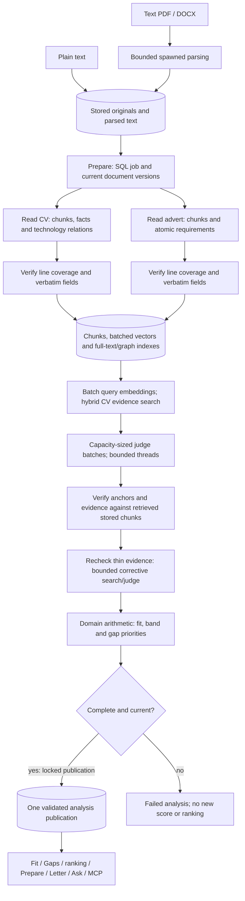
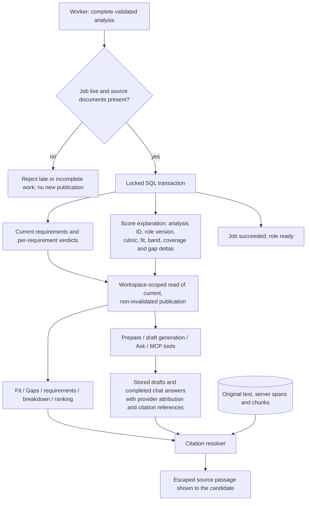
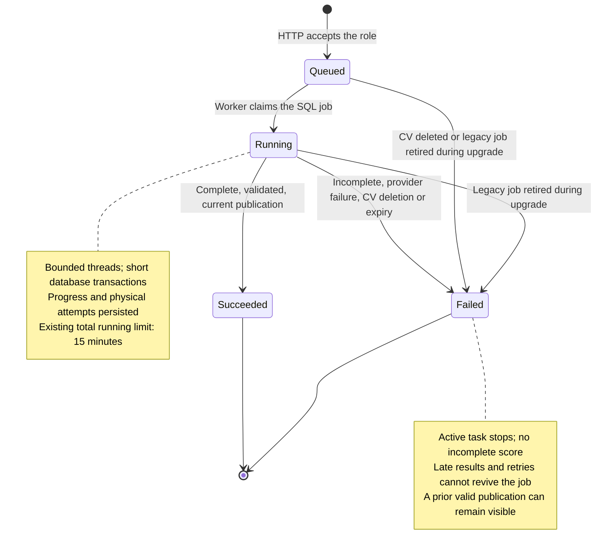
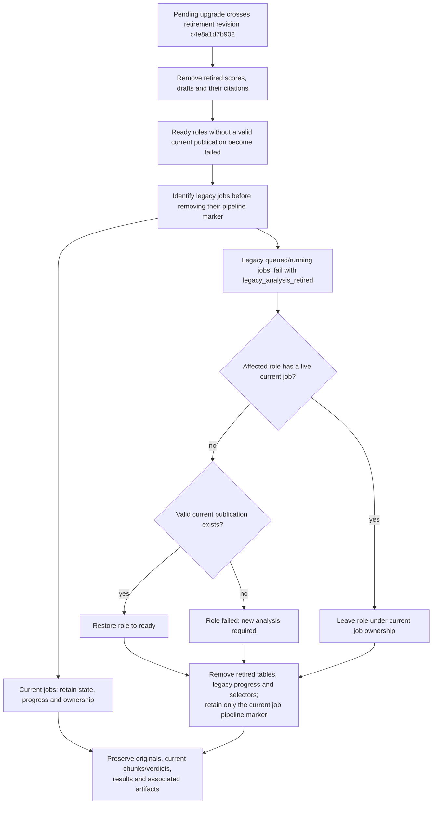

# Architecture — one evidence-bound analysis

Current behavior, 2026-10-06. See [ADR 016](adr/016-consolidated-parallel-analysis.md)
and [PLAN 19](../PLAN.md). The retired span-classification/assessment pipeline is
implementation history, not an alternate runtime or a release dependency.

## Entry points and ownership

The [README system diagram](../README.md#architecture) shows the processes and
external providers. The browser talks to the TanStack Start same-origin `/api/**`
proxy, which forwards to FastAPI. HTTP routes translate requests into application
services; domain code owns scoring; SQL and provider adapters implement ports.
The route-to-service/store map is [production-wiring.md](production-wiring.md).

- Uploads store original bytes, parsed text and server-issued spans in PostgreSQL.
  Text PDF/DOCX parsing runs in spawned processes; plain text stays inline.
- Creating or reanalysing a role queues a SQL job and returns `202` with its ID.
  The in-process worker claims it; the browser polls `GET /api/jobs/{id}`.
- Fit and Gaps use `GET /api/roles/{id}/verdicts`. Other result endpoints project
  the same publication; they do not run another matcher or fit calculation.
- Ask uses `POST /api/messages` with JSON or SSE. Its retrieval/agent tools read
  stored documents and validated results. The read-only stdio MCP entry point
  shares the workspace tools, but does not run an answer model itself.

## Analysis flow and dependencies

Independent reads overlap up to the selected execution profile. Independent judge
batches overlap up to the same bounded completion limit. A fitting document uses
one structured call: chunks, contextual search descriptions, technology terms,
atomic requirements and technology relationships come back together. Server-side
line coverage and verbatim checks run before storage. Relationships represent
inferred general knowledge and never candidate evidence.

The judge receives retrieved stored chunks and requirement facts. Input and output
budgets both determine batch size. The judge may request one better retrieval query
per requirement, bounded by the analysis rewrite cap; only changed candidate sets
are rejudged together. A failed/incomplete judgment publishes no fit score.
Fit is arithmetic over validated judgments. All product views use that result;
shared draft/citation view types do not introduce another matching/scoring path.

## Publication and evidence reads

The score explanation identifies the analysis and the role's current version.
Reads require that version and a non-invalidated current-pipeline result. A missing
publication yields `analysis_incomplete` for result endpoints and no ranking
position. A genuine zero from a complete analysis is still a scored result.
A failed reanalysis can leave the last valid publication visible; replacing the CV
invalidates its results and removes old CV evidence before new results are used.

Prepare and gap ordering project stored judgments. Writing and Ask can invoke the
configured completion adapter, but cannot replace the published fit arithmetic.
Generated versions are distinct from uploaded supporting letters. Supporting
letters can be cited in Ask/drafting; they are never candidate fit evidence.
Citation resolution checks provenance against stored text. That proves where a
passage came from; it does not by itself prove that a model's judgment is correct.

## Execution boundaries

- Threads overlap network/database waits. Fan-out copies cancellation, accounting
  and progress context, caps workers, preserves result order and cancels queued
  siblings after a failure. Database transactions never span model waits.
- A small process pool uses Python's spawn mode for binary document parsing. Only
  immutable document bytes/options cross the boundary; no SQL session, provider
  client or configured API key is passed as a task argument. Plain text stays
  inline. Admission checks precede dispatch; process timeout/shutdown terminates
  workers. Upload routes perform blocking work outside the HTTP event loop.
- PostgreSQL owns queued jobs, progress and results. HTTP enqueues and returns
  `202`; the bounded in-process executor claims jobs and publishes atomically.
  The existing 15-minute total running limit is checked at startup and roughly
  every five seconds during operation, including while provider calls are pending.
  This remains a single-user process with SQL-backed jobs, not a distributed queue.
- A per-document lock prevents concurrent roles indexing the same CV twice inside
  one process. Idle locks are weak references. Multi-process API deployment requires
  a database/advisory lock before it can claim the same deduplication guarantee.

## Providers and budgets

Ollama, OpenAI and Anthropic have separate transport/schema adapters. Model profiles
in [models.toml](../config/models.toml) provide context/output limits, operational
output caps, completion/embedding concurrency and estimated tokens per verdict.
The application reads these fields instead of vendor-name branches.

Ollama's local concurrency can be tuned for available hardware. OpenAI/Anthropic
use larger configured context/output budgets and a shared hosted gate that honors
response rate-limit headers. Anthropic completion uses an independent embedding
provider. Extraction/judging remain deterministic where the model supports it;
generated writing can use the adapter's supported creative controls. The schema and
evidence invariant apply equally to every provider.

Ollama embeddings use its native batched /api/embed endpoint with truncation disabled
([official API](https://docs.ollama.com/api/embed)). OpenAI already accepts batched
inputs. Model identity/dimensions permit cache checks without a probe. Cached CV
chunks/vectors and cached verdicts avoid provider calls entirely. A tag's published
limits must be configured accurately; estimates use approximate token counts.

## Progress, failure and attribution

Each stage persists states, timings, work units and planned/finished model/embedding
calls. Retries increase actual attempts. Counts omit reused/skipped work and show
undiscovered downstream work as an incomplete estimate. Repairs/splits may add
calls; the UI labels remaining calls and time as estimates. Time uses current pace
and recent measured stage durations; overlapping reads use the longest remaining
read while they run together. Without history the estimate stays unknown.

Judge/recheck requirement counts advance when a batch finishes, rather than while
individual judgments are still pending. The Fit list filters status and the stored
requirement score locally; overall fit, evidence and published ranking stay intact.

Structured output has bounded validation repair and truncation fallback. Expired,
cancelled or deleted jobs cannot publish results. Every physical retry checks
job liveness; failure recording locks and preserves terminal state. Cancellation is
cooperative: a synchronous HTTP call already sent may retain its worker thread
until it finishes or its transport times out. Citations resolve server-created spans
backed by stored chunks. Provenance records provider/model and whether content
left the machine; operational accounting holds identifiers/counts, never content.

## Job lifecycle

Hard-deleting a role removes its job rows altogether; this is removal, not another
persisted job state. The read-only job endpoint can return HTTP 200 for a failed job:
clients inspect state/error and stop polling terminal outcomes. See the
[API contract](api-contract.md) and [local operations](running-locally.md).

## Storage and scope

One PostgreSQL/pgvector schema stores original documents, spans/chunks, full-text
index, vectors, graph, verdicts, score, generated drafts, chat and provider-call
accounting. Durable action/event/HTTP audit storage remains backlog work; it is not
an implemented service or a separate data store.
Hard deletion removes originals and derived records. Forward migrations retire the
old requirements/claims/mappings/embedding storage and obsolete analysis results;
original documents remain available for current reanalysis. The retirement upgrade
ends legacy queued/running jobs before removing their marker, preserves active current
jobs and restores an earlier valid current publication when available. Populated
migration and publication-consumer/deletion regressions pass under PLAN 19.1.
Already-applied retirement revisions cannot recover the old erased job identity.

### Retirement upgrade

This is a one-time forward migration, not a runtime pipeline selector. Old results
cannot be converted into current results; their original documents remain for
reanalysis. Downgrade restores historical schema, not erased data. Databases that
already applied this revision do not rerun it, and the earlier erased marker cannot
be reconstructed safely. See [local upgrade guidance](running-locally.md).

REST/SSE, the job worker and read-only stdio MCP are entry points into the same
application services. API/worker model calls use separate provider adapters. Local
Ollama remains local; hosted calls require enabled egress and configured keys. The
MCP server reads shared SQL-backed workspace tools and does not choose a model
provider. MCP remains off by default and its client decides where returned text
goes. There is no authentication/multi-tenancy; deployments remain private and
single-user.
Quality and latency are measured only in [evaluation.md](evaluation.md).
