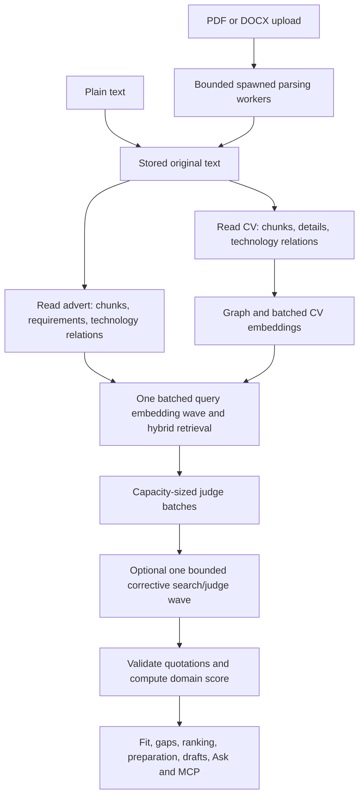

# Architecture — one evidence-bound analysis

Current direction, 2026-10-02. See [ADR 016](adr/016-consolidated-parallel-analysis.md)
and [PLAN 19](../PLAN.md). The retired span-classification/assessment pipeline is
implementation history, not an alternate runtime or a release dependency.

## Flow and dependencies

Independent reads overlap up to the selected execution profile. Independent judge
batches overlap up to the same bounded completion limit. A fitting document uses
one structured call: chunks, contextual search descriptions, technology terms,
atomic requirements and technology relationships come back together. Server-side
line coverage and verbatim checks run before storage. Relationships represent
inferred general knowledge and never candidate evidence.

The judge receives retrieved stored chunks and requirement facts. Input and output
budgets both determine batch size. The judge may request one better retrieval query
per requirement, bounded by the analysis rewrite cap; only changed candidate sets
are rejudged together. A failed/incomplete judgment publishes no fit score.
Fit is arithmetic over validated judgments. All product views use that result;
shared draft/citation view types do not introduce another matching/scoring path.

## Execution boundaries

- Threads overlap network/database waits. Fan-out copies cancellation, accounting
  and progress context, caps workers, preserves result order and cancels queued
  siblings after a failure. Database transactions never span model waits.
- A small process pool uses Python's spawn mode for binary document parsing. Only
  immutable document bytes/options cross the boundary; no SQL session, provider
  client or configured API key is passed as a task argument. Plain text stays
  inline. Admission checks precede dispatch; process timeout/shutdown terminates
  workers. Upload routes perform blocking work outside the HTTP event loop.
- PostgreSQL owns queued jobs and results. Work runs in a bounded in-process job
  executor. This is a local, single-user monolith rather than a distributed queue.
- A per-document lock prevents concurrent roles indexing the same CV twice inside
  one process. Idle locks are weak references. Multi-process API deployment requires
  a database/advisory lock before it can claim the same deduplication guarantee.

## Providers and budgets

Ollama, OpenAI and Anthropic have separate transport/schema adapters. Model profiles
in [models.toml](../config/models.toml) provide context/output limits, operational
output caps, completion/embedding concurrency and estimated tokens per verdict.
The application reads these fields instead of vendor-name branches.

Ollama's local concurrency can be tuned for available hardware. OpenAI/Anthropic
use larger configured context/output budgets and a shared hosted gate that honors
response rate-limit headers. Anthropic completion uses an independent embedding
provider. Extraction/judging remain deterministic where the model supports it;
generated writing can use the adapter's supported creative controls. The schema and
evidence invariant apply equally to every provider.

Ollama embeddings use its native batched /api/embed endpoint with truncation disabled
([official API](https://docs.ollama.com/api/embed)). OpenAI already accepts batched
inputs. Model identity/dimensions permit cache checks without a probe. Cached CV
chunks/vectors and cached verdicts avoid provider calls entirely. A tag's published
limits must be configured accurately; estimates use approximate token counts.

## Progress, failure and attribution

Each stage persists states, timings, work units and planned/finished model/embedding
calls. Retries increase actual attempts. Counts omit reused/skipped work and show
undiscovered downstream work as an incomplete estimate. Repairs/splits may add
calls; the UI labels remaining calls and time as estimates. Time uses current pace
and recent measured stage durations; overlapping reads use the longest remaining
read while they run together. Without history the estimate stays unknown.

Structured output has bounded validation repair and truncation fallback. Cancelled
or deleted jobs cannot publish results. Citations resolve server-created spans
backed by stored chunks. Provenance records provider/model and whether content
left the machine; operational accounting holds identifiers/counts, never content.

## Storage and scope

One PostgreSQL/pgvector schema stores original documents, spans/chunks, full-text
index, vectors, graph, verdicts, score, generated drafts, chat and operational audit.
Hard deletion removes originals and derived records. Forward migrations retire the
old requirements/claims/mappings/embedding storage and obsolete analysis results;
original documents remain available for current reanalysis.

REST/SSE, the job worker and read-only stdio MCP are entry points into the same
application services. Hosted calls still require enabled egress and configured keys.
MCP remains off by default and its client decides where returned text goes. There
is no authentication/multi-tenancy; deployments remain private and single-user.
Quality and latency are measured only in [evaluation.md](evaluation.md).
