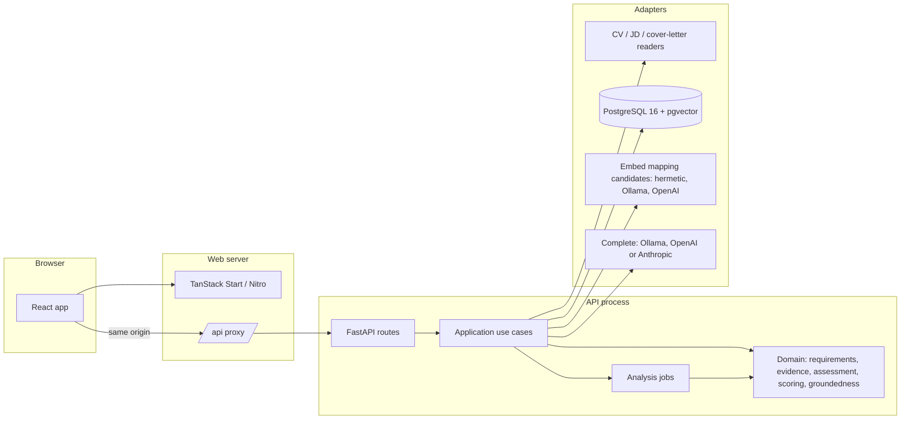
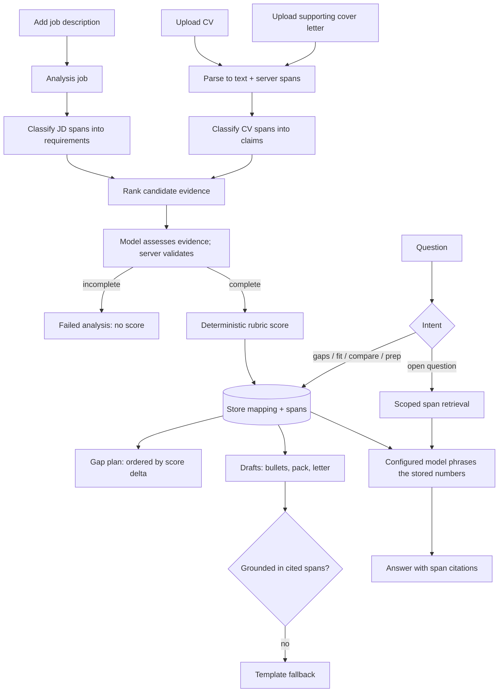

# Architecture — v1, the running path

> This page describes what runs today. The accepted next architecture, being built
> in PLAN Phase 18, is [architecture-v2.md](architecture-v2.md).

The decisions behind it: [ADR 010](adr/010-model-first-extraction.md) is why
extraction is model-first, [ADR 011](adr/011-evidence-assessment-contract.md) is the
evidence-assessment contract and [ADR 012](adr/012-durable-operational-audit.md) is
the operational-audit contract. Every decision is in [adr/](adr/).

## The engineering thesis

A naive version of this product asks a model "how good is this candidate for this
job?" and prints the paragraph it returns. That is unverifiable, irreproducible and
flatters the user.

This build inverts it. The model does **classification, assessment and phrasing**,
never the score:

1. **Classify the job description.** The server splits the stored text into spans with
   server-issued ids. The model labels each span — requirement, responsibility,
   benefit, logistics or non-requirement — with a competency and must-have versus
   desirable. It returns ids, never rewritten text, so Markdown or bullet formatting
   cannot lose a requirement. Only requirements and responsibilities are scored; a
   salary line or a section heading never is.
2. **Classify the CV** the same way, into claims under their roles — employer, title,
   date range, scope, technologies, outcome. Duration and recency are derived in
   domain code from the parsed dates. Cover letters extract into the same shape,
   flagged self-authored. [ADR 011](adr/011-evidence-assessment-contract.md) says
   concrete experience in an uploaded letter can count, with its source shown and
   duplicates removed; an aspiration does not, and a generated draft never raises the
   score. The running matcher still excludes letter claims.
3. **Assess the evidence.** Lexical overlap and embedding cosine rank a bounded set of
   candidate claims for each requirement. The configured completion model assesses
   that evidence against the requirement's criteria, in bounded batches, returning
   `met`, `partial` or `missing`, the supporting span ids, unmet conditions and a
   contradiction flag. The server validates every assessment. A missing or invalid
   one makes the analysis **incomplete** — a failed analysis, never a match and never
   a low score. Hermetic tests use a lexical/embedding fallback and call no model.
4. **Score deterministically** from the validated mapping. The fit score is arithmetic
   in domain code, weighted by the rubric in `config/scoring_rubric.toml`. No model
   emits a number, and an incomplete analysis publishes none.
5. **Answer and draft** from the stored mapping and the cited spans only, with a
   validator that rejects any generated sentence asserting something the cited spans
   do not contain, and a template fallback when it does.

The consequence is that the score is reproducible, the reasoning is inspectable, and
the system cannot invent experience the candidate does not have. When evidence is
absent it says so rather than filling the gap.

## Components and boundaries

Ports and adapters at the edges. Domain and application code import no web framework,
no ORM and no provider SDK; an architecture guard test fails the build if they do.

The browser talks to one origin. The Start server proxies `/api/**` to FastAPI, so
there is no API URL in browser code and no CORS configuration in this repository.

Production `create_production_app()` wires SQL stores and the in-process analysis
worker. Hermetic `create_app()` keeps in-memory stores for default tests. Every
answer and generated draft records provider, model, `leftMachine`, groundedness and
fallback; see [ADR 007](adr/007-grounded-generation.md) and
[docs/production-wiring.md](production-wiring.md).

### Request flow

Intent routing is deterministic. Gap, fit, comparison and interview-prep questions
are phrased by the configured model from the stored mapping and its score; the model
does not calculate a new score. Open questions retrieve workspace-scoped spans,
including an uploaded letter when it is relevant to the question.

## Stack

| Area | Choice | Reason |
|---|---|---|
| Backend | Python 3.14+, FastAPI, Pydantic | Typed API, mature AI ecosystem |
| Frontend | TanStack Start, React 19, strict TypeScript, designed in Lovable | The design is the deliverable; the server carries the API proxy |
| Store | PostgreSQL 16 + pgvector | System of record for original uploads, parsed spans, roles, mappings, generated drafts, questions, answers and requirement/claim vectors |
| Persistence | SQLAlchemy 2, Alembic | Explicit schema, repeatable migrations and transactionally consistent deletion |
| Models | One port per concern, four adapters: hermetic, Ollama, OpenAI, Anthropic | Switchable at runtime; hosted behind an egress gate |
| Long work | In-process job queue with a polled job resource | Extraction takes minutes; it is a job, not a request |
| Orchestration | Direct use cases, no agent framework | Visible control flow, no hidden hosted defaults |
| Local run | Make with local PostgreSQL, or Compose with container PostgreSQL | Same migrations and repositories in both topologies |
| Tests | pytest, Vitest, React Testing Library; Playwright planned | Unit, contract, API, integration, component and evaluation today; end-to-end is PLAN 16.5 |

Default *tests* are hermetic: lexical embeddings and a rule-based extractor, so a
reviewer can clone and test with no key and no model download. The running product
defaults to a local Ollama model.

## RAG and LLM approach

| Piece | Choice | Why |
|---|---|---|
| LLM | Local Ollama `qwen2.5:7b` by default; OpenAI or Anthropic when the egress gate allows | Local keeps personal data on the machine; the model was chosen by measurement, not preference |
| Embeddings | Ollama `nomic-embed-text`; OpenAI `text-embedding-3-small`; lexical hashing in tests | Rank candidate evidence; chosen independently of the completion model |
| Vector store | pgvector columns in PostgreSQL, exact cosine in Python per analysis, no approximate index | Tens of vectors per analysis; one system of record with transactional hard delete ([ADR 002](adr/002-postgres-pgvector.md), [ADR 009](adr/009-vectors-propose-mapping-candidates.md)) |
| Retrieval | Lexical overlap plus embedding similarity rank a bounded candidate set with adjacent sentences, so negation and dates survive | The similarity floor ranks evidence instead of gating it; every mapping records what the assessor saw |
| Orchestration | Direct use cases and an in-process job queue; no LangChain or LlamaIndex | Visible control flow and no hidden hosted default |
| Prompts and context | Versioned prompts recorded on every result (`evidence-assessment-v5`, `cover-letter-v2`). Bounded batches: up to 4 requirements per assessment call and 12 CV spans per classification call, with one retry for missing items only. Budgets: `MAX_QUESTION_CHARS` 4,000, `MAX_CONTEXT_CHARS` 24,000, `LLM_MAX_OUTPUT_TOKENS` 2,000 | Truncated JSON from one large call was the observed live failure |
| Guardrails | Server-owned spans (the model returns ids, never evidence text); schema and id validation on every provider; incomplete analysis publishes no score; groundedness validator with template fallback; untrusted text delimited in every prompt; an injection fixture in the test suite; the egress gate | The model may phrase and assess; it may not assert anything the stored text does not contain |
| Quality | A labelled synthetic pilot, a hermetic baseline and dated live runs in [docs/evaluation.md](evaluation.md) | Numbers appear only where a run observed them |
| Observability | See [Observability](running-locally.md#observability) | Ids, counts and durations — never document text |
