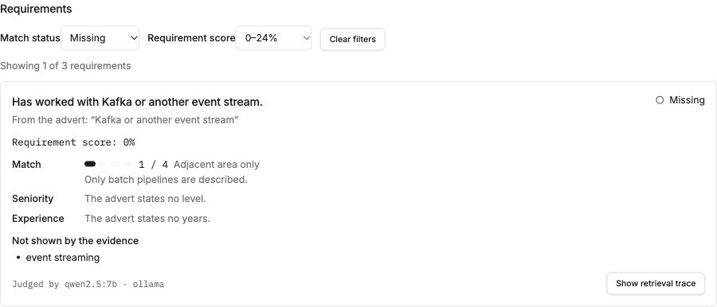
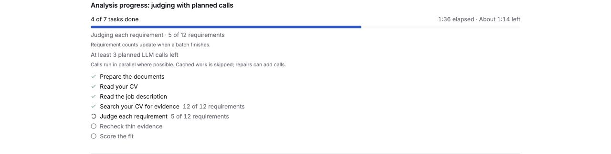

# How to use it

1. **Start the stack** — see [Quick start](running-locally.md). Open the web app at
   `http://localhost:3000` (both paths use `WEB_PORT`, default 3000).
2. **Upload a CV** on Workspace (PDF, DOCX or paste). Optionally upload supporting
   cover letters — Ask and drafting can cite them; they are not fit evidence today.
3. **Add a role** with a job description. Analysis runs as a job; wait until the role
   is `ready`. While it runs, the roles list and the role page show how many tasks
   are done out of the total, the task running now (for example "Judging each
   requirement · 5 of 12 requirements"), the elapsed time and an estimate of the time
   left. A queued analysis shows how many are ahead of it. The estimate comes from
   your recent analyses, so the first one shows "Estimating time left…" until it
   has something to go on. An analysis the model could not complete shows
   **Analysis incomplete** with a retry, never a fake low score.
   Judgment counts update when a batch finishes, so they can stay at zero while
   a whole batch is pending. The existing 15-minute running limit is enforced
   during operation; an expired job fails visibly without restarting the API.
   Deleting the role, or the CV, stops its analysis: no further model call is made,
   although one already in flight finishes first.
4. **Open the role** and work the tabs:
   - **Fit** — summary, score breakdown, and every scoreable requirement as met /
     partial / missing with cited evidence. Use **Match status** and
     **Requirement score** together to focus the list; **Clear filters** restores
     every requirement. The count shows how many are visible. Filtering preserves
     the overall fit and evidence. Requirement scores are the stored domain values
     shown as whole percentages; **Not scored** stays separate from zero. Fit
     shows each requirement's match, seniority and experience scores (0–4, with the
     words the judge was given and its reason), the quotes behind them, keyword
     coverage with terms found only under another name flagged, and a retrieval trace
     per requirement. Gaps then lists which score to raise and what closing it would
     add.
   - **Gaps** — ordered by score impact; draft a CV bullet only when a cited claim
     already supports it.
   - **Prepare** — interview probes, lead-with evidence, thin areas.
   - **Letter** — generate a grounded cover letter; citations appear as `[1]`, `[2]`
     with the full source passage in the right-hand glossary.
5. **Ask** questions about gaps, fit or anything in your documents; citation chips open
   the source span. When the answer model can call tools, an open question is
   answered by the agent, and "Found using N tool calls" under the answer shows what
   it searched.
6. **Settings** — choose the answer and index providers. Hosted providers are offered
   only when egress is enabled on the server, and choosing one requires acknowledging
   that document text may leave the machine.
7. **Optional: MCP** — let Claude Desktop or Cursor read the same workspace,
   read-only. It is off until you enable it; see [MCP server](mcp.md).

## Screenshots

Refreshed 2026-10-05 from the current app's `/dev/states` component gallery.
These are rendered synthetic examples of the shipped components, not personal
documents or measured model outputs. Gallery actions use local fixtures;
provider availability and scores illustrate UI states rather than this machine's
configuration. Capture details: [images/README.md](images/README.md).

*Workspace — completed roles, fit scores and requirement counts.*

*Settings — example answer/index provider choices and availability reasons.*

*Fit — overall fit, keyword coverage, requirement scores and status/score filters.*

*Requirements — Missing combined with 0–24%, without changing overall fit.*

*Progress — batches update their counts on completion; timing here is a fixed fixture.*

*Gaps — ordered by how much the score would move if you closed each gap.*

*Prepare — interview probes and evidence drawn from the published analysis.*

The **Letter** tab generates a grounded cover letter. After generate, citations show
as `[1]`, `[2]` with the full source passage in the Citations panel on the right.

## What it answers

- "What skills am I missing for this role, and which gap is worth closing first?"
- "How does my experience align with role #2 versus role #3?"
- "Which of my projects best evidences the platform engineering requirement?"
- "What will they probe in interview, and where am I thin?"
- "Rank these five roles by fit and tell me why the ranking is what it is."
