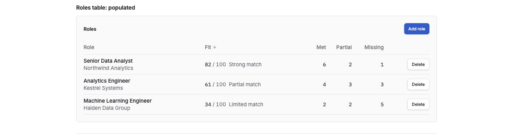
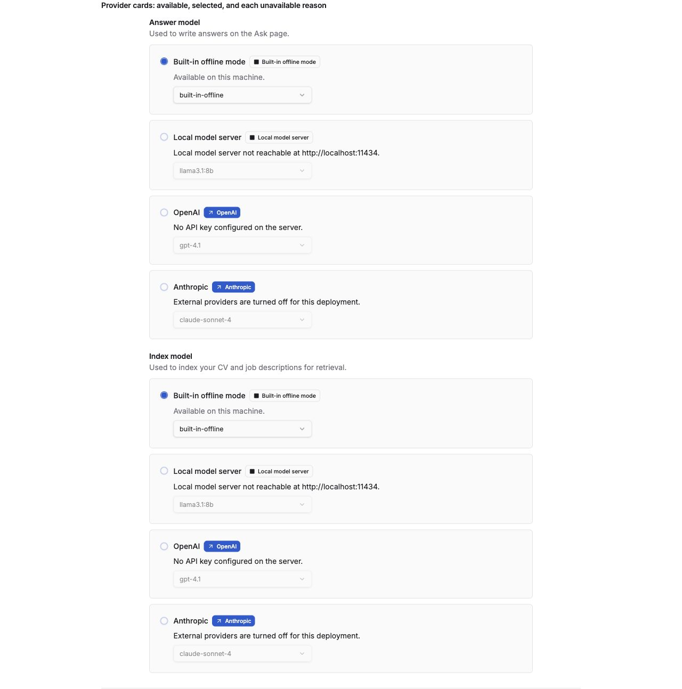
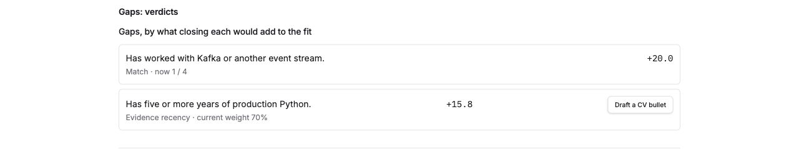
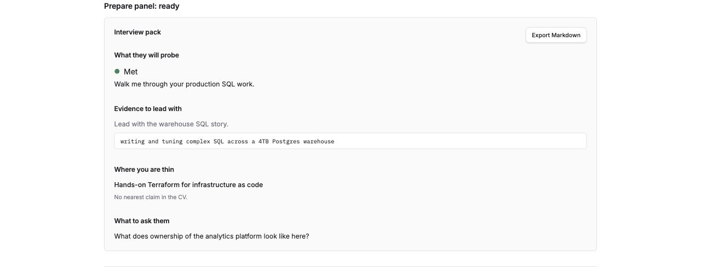

# How to use it

1. **Start the stack** — see [Quick start](running-locally.md). Open the web app at
   `http://localhost:3000` (both paths use `WEB_PORT`, default 3000).
2. **Upload a CV** on Workspace (PDF, DOCX or paste). Optionally upload supporting
   cover letters — Ask and drafting can cite them; they are not fit evidence today.
3. **Add a role** with a job description. Analysis runs as a job; wait until the role
   is `ready`. While it runs, the roles list and the role page show how many tasks
   are done out of the total, the task running now (for example "Judging each
   requirement · 5 of 12 requirements"), the elapsed time and an estimate of the time
   left. A queued analysis shows how many are ahead of it. The estimate comes from
   your recent analyses, so the first one shows "Estimating time left…" until it
   has something to go on. An analysis the model could not complete shows
   **Analysis incomplete** with a retry, never a fake low score.
   Deleting the role, or the CV, stops its analysis: no further model call is made,
   although one already in flight finishes first.
4. **Open the role** and work the tabs:
   - **Fit** — summary, score breakdown, and every scoreable requirement as met /
     partial / missing with cited evidence.
   - **Gaps** — ordered by score impact; draft a CV bullet only when a cited claim
     already supports it.
   - **Prepare** — interview probes, lead-with evidence, thin areas.
   - **Letter** — generate a grounded cover letter; citations appear as `[1]`, `[2]`
     with the full source passage in the right-hand glossary.
5. **Ask** questions about gaps, fit or anything in your documents; citation chips open
   the source span.
6. **Settings** — choose the answer and index providers. Hosted providers are offered
   only when egress is enabled on the server, and choosing one requires acknowledging
   that document text may leave the machine.

## Screenshots

Captured from the running app by the maintainer (not mocks).

*Workspace — upload a CV and supporting letters, add roles, see fit ranking.*

*Settings — choose the answer and index providers behind the egress gate.*

*Fit — score breakdown plus every scoreable requirement as missing, partial or met with evidence.*

*Gaps — ordered by how much the score would move if you closed each gap.*

*Prepare — interview probes grounded in met, partial and missing mappings.*

The **Letter** tab generates a grounded cover letter. After generate, citations show
as `[1]`, `[2]` with the full source passage in the Citations panel on the right.

## What it answers

- "What skills am I missing for this role, and which gap is worth closing first?"
- "How does my experience align with role #2 versus role #3?"
- "Which of my projects best evidences the platform engineering requirement?"
- "What will they probe in interview, and where am I thin?"
- "Rank these five roles by fit and tell me why the ranking is what it is."
