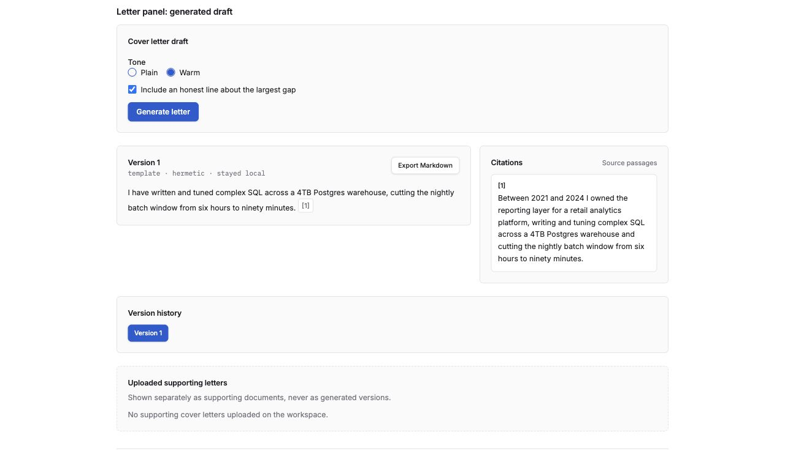
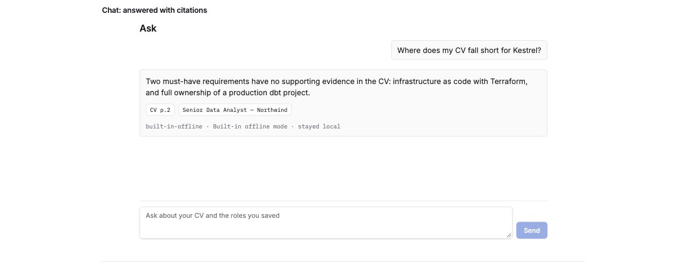

# How to use it

## Start and choose providers

Follow [Running locally](running-locally.md), then open `http://localhost:3000`
(`WEB_PORT` defaults to 3000). This is a private, single-user local app.

In **Settings**, choose the **Answer model** and **Index model**. Local models need
Ollama running with the selected models downloaded. Hosted choices require server
egress to be enabled, a configured key and your acknowledgement that document text
may leave the machine. Unavailable cards explain what is missing. Keep credentials
in server configuration; never paste them into a document or question. See
[provider configuration](model-providers.md).

## Add evidence and a role

1. On **Workspace**, upload a text PDF or DOCX CV, or paste its text. Scanned-image
   PDFs are not supported. There is one CV per workspace.
2. Optionally add supporting cover letters. Ask and drafting can cite them, but
   they do not count as CV evidence for fit.
3. Add a role with its title, company and job description. The app stores the
   advert and queues an analysis. Open the role to follow its progress.

Replacing the CV invalidates results based on the old document. Wait for the new
analyses before interpreting fit, ranking or generated material.

## Follow the analysis

The seven tasks prepare the documents, read your CV, read the advert, search for CV
evidence, judge each requirement, recheck thin evidence and score the fit. Independent
reads can overlap. The progress display shows completed tasks, the current task,
requirement counts, elapsed time and estimated remaining time/calls. A queued job
shows how many analyses are ahead of it. First-run estimates can be unknown.

Judgment counts advance when a batch finishes. **0 of 29** can mean the first batch
is still waiting; it is not a completed zero score. Estimates may change when a
provider retries or more corrective work is discovered. The existing total running
limit is 15 minutes; expiry is checked during operation and fails visibly.

A failed or incomplete analysis shows an explanation and retry instead of publishing
an unsupported score. Check provider availability/configuration, resolve the cause,
then retry. A failed reanalysis can keep an earlier valid result visible. Deleting
a role or CV prevents its job from publishing; a provider request already sent can
finish before its worker thread returns.

## Read Fit and filter requirements

Open a ready role's **Fit** tab. The overall fit comes from domain arithmetic over
validated judgments; the model does not choose that score. Each requirement shows
**Met**, **Partial** or **Missing**, its requirement percentage, match/experience/
seniority judgments and their reasons, cited CV evidence and unmet conditions.
A dimension that the advert does not specify is labelled accordingly.

- Set **Match status** to Missing to focus on gaps, Partial to find thin evidence,
  or Met to review supported requirements.
- Combine it with **Requirement score**, for example Missing and **0–24%**.
  The visible count changes; **Clear filters** restores the full list.
- Requirement percentages describe individual requirements. They are not points
  added to the overall fit, and filtering does not change that fit or the ranking.
- **Not scored** is separate from a genuine scored zero. A role without a complete
  publication has no fit judgment or ranking position.
- Review quoted evidence and **Show retrieval trace** to understand what was found.
  Keyword coverage distinguishes exact terms, aliases and absent terms; it is not
  another fit score. A citation identifies a source passage, so read the passage
  before relying on the judgment.

## Turn the result into preparation and drafts

- **Gaps** orders opportunities by the potential fit-score increase if the stated
  dimension improves. A `+9.4` is a possible gain, not points already earned or a
  guarantee. Draft a CV bullet only where existing cited evidence supports it;
  copy the draft yourself after checking it. The app does not edit your CV file.
- **Prepare** shows likely interview probes, evidence to lead with, thin areas and
  questions to ask. Open the source buttons and export the pack as Markdown.
- **Letter** offers Plain/Warm tone and an optional honest line about the largest
  gap. Generate a draft, review `[1]`, `[2]` citations against the source glossary,
  select earlier generated versions or export Markdown. The app refuses generation
  when fewer than two must-have requirements are met and directs you to Gaps.
  Uploaded supporting letters are shown separately from generated versions.

Fit, gaps, ranking, preparation, drafts and grounded questions consume the same
validated publication. They do not rerun a competing fit calculation.

## Ask grounded questions

Open **Ask** and use a starter question or enter your own. Try “What am I missing for
this role?” or “Which project best supports the platform requirement?” Citation
chips open source passages. An answer can say there is not enough evidence rather
than inventing candidate experience. Provider/model attribution identifies how the
answer was produced and whether content left the machine.

For open questions, a tool-capable answer model can search the workspace through
an agent. **Found using N tool calls** lists those steps. Fit/gap/compare/preparation
questions use the corresponding grounded route. During an active stream, **Stop**
lets you stop the response. Only completed answers are persisted.

To let an external client read the workspace, enable the optional read-only
[MCP server](mcp.md). It is off by default. Your MCP client's model and its handling
of returned document text are configured in that client.

## Reanalyse after an upgrade

The retirement migration preserves uploads and valid current results. It removes
retired analysis results and associated drafts. A role with no valid current result
needs a new analysis; a legacy live job ends with “This analysis was retired. Run a
new analysis.” Original documents remain available, so use the role's retry/reanalysis
action. Current live jobs retain ownership and valid current results remain usable.

The correction runs when an upgrade crosses retirement revision `c4e8a1d7b902`.
Already-upgraded databases do not rerun it. Do not downgrade a personal database to
repeat retirement: deleted historical data is not restored. More details are in
[local upgrade guidance](running-locally.md).

## Screenshots

Refreshed 2026-10-06 from this branch's `/dev/states` component gallery. These are
actual rendered components with synthetic fixtures, not personal documents or
measured model outputs. Each image shows a separate example; role names, scores,
provider availability and timings are illustrative. Gallery actions stay local.
[Capture details and provenance](images/README.md).

*Workspace — ready roles, overall fit and requirement counts.*

*Settings — availability reasons explain why a provider cannot be selected.*

*Progress — requirement batches, completed calls and estimated remaining work.*

*Fit — validated judgments, evidence, unmet conditions and requirement percentages.*

*Filters — Missing combined with 0–24%, showing one of three requirements.*

*Gaps — potential improvements, including evidence recency.*

*Prepare — probes, cited evidence, thin areas and questions to ask.*

*Letter — a synthetic cited paragraph, source glossary, export and version history.*

*Ask — a synthetic completed answer, citations and provider attribution.*
